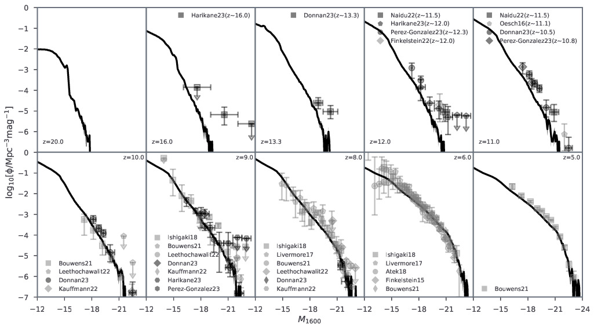
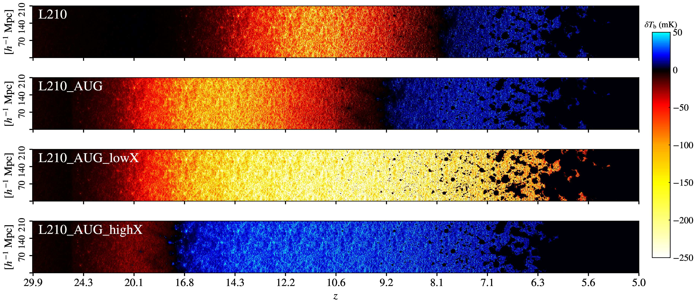

# Introduction

**Meraxes is a semi-analytic galaxy formation model for studying the first
stars, galaxies and black holes, and their effects on the intergalactic medium
(IGM).** It follows galaxy growth through dark-matter halo merger trees and
couples their ultraviolet and X-ray emission to the ionization and thermal
state of the surrounding gas.

During cosmic dawn and the Epoch of Reionization, radiation from early
sources heated the IGM and ionized its neutral hydrogen. Galaxy surveys
measure the luminous sources, while the redshifted 21-cm signal probes the
neutral gas around them. Connecting these observations requires a model
that links the abundance and properties of galaxies to the radiation they
produce and the response of the IGM.

## Galaxies and reionization

Meraxes was developed within the DRAGONS project to follow this connection
in both space and time ([Mutch et al. 2016](https://doi.org/10.1093/mnras/stw1506)).
The underlying N-body simulation supplies halo masses, positions and merger
histories. Semi-analytic prescriptions then evolve the gas, stars, metals
and black holes associated with each halo. This approach combines galaxy
formation histories with the large volumes needed to describe the growth
and overlap of ionized regions.

A merger tree connects a halo to its progenitors and descendants; a forest
groups connected trees. Meraxes advances the galaxy population one snapshot
at a time. At each snapshot, emission from galaxies across the volume
contributes to shared radiation fields. Their local ionization histories and
radiation backgrounds then influence gas accretion in subsequent snapshots.
This coupling allows galaxies to affect neighbours well beyond their own
merger trees.

| Component | Physical role |
|---|---|
| Gas and stars | Gas accretion and cooling supply star formation; stellar evolution returns mass, metals and energy. |
| Black holes | Accretion and mergers grow black holes; active galactic nuclei provide radiation and feedback. |
| Radiation and the IGM | A modified **21cmFAST** calculation follows ionized regions, X-ray heating, spin temperature and the 21-cm signal. |
| Photoheating feedback | The evolving ultraviolet background reduces the gas supply of susceptible low-mass haloes. |
| Early stellar populations | Optional mini-halo physics follows metal-free stars, molecular cooling, Lyman–Werner radiation and enrichment. |

The principal extensions describe AGN growth and radiation
([Qin et al. 2017](https://doi.org/10.1093/mnras/stx1909)), stellar spectra and dust
([Qiu et al. 2019](https://doi.org/10.1093/mnras/stz2233)), IGM heating and the 21-cm signal
([Balu et al. 2023](https://doi.org/10.1093/mnras/stad281)), and Population III stars
([Ventura et al. 2024](https://doi.org/10.1093/mnras/stae567)).

## From galaxies to observables

The galaxy population provides stellar masses, star-formation rates, gas
and metal reservoirs, black-hole properties and luminosities. Stellar
population modelling connects star-formation histories to ultraviolet
luminosities, colours and luminosity functions, allowing comparison with
high-redshift galaxy surveys.

Galaxy UV luminosity functions: model predictions (black curves) and observational measurements (grey symbols). [Meraxes](https://github.com/qyx268/meraxes-devs/blob/forests/output/results/figs/glfs.jpg); [figure licence](docs/_static/MERAXES-LICENSE.txt).

The IGM calculation predicts the neutral fraction and gas temperatures
throughout the volume. These fields determine whether neutral hydrogen
appears in 21-cm absorption or emission against the cosmic microwave
background. Coeval maps describe individual times; lightcones show the
evolution along the line of sight, while power spectra quantify the
spatial fluctuations. Together, galaxy and 21-cm observables connect the
sources of radiation to the timing and structure of cosmic heating and
reionization.

21-cm lightcones for four model configurations. Warm colours show absorption and blue shows emission; the panels illustrate changes in the heating and reionization histories. [Meraxes](https://github.com/qyx268/meraxes-devs/blob/forests/output/results/figs/lcs.jpg); [figure licence](docs/_static/MERAXES-LICENSE.txt).

## References

- **Mutch et al. (2016).** *DRAGONS III. Modelling galaxy formation and the epoch of reionization.* [MNRAS, 462, 250–276](https://doi.org/10.1093/mnras/stw1506).
- **Qin et al. (2017).** *DRAGONS X. The small contribution of quasars to reionization.* [MNRAS, 472, 2009–2027](https://doi.org/10.1093/mnras/stx1909).
- **Qiu et al. (2019).** *DRAGONS XIX. Predictions of infrared excess and cosmic star formation rate density from UV observations.* [MNRAS, 489, 1357–1372](https://doi.org/10.1093/mnras/stz2233).
- **Balu et al. (2023).** *Thermal and reionization history within a large-volume semi-analytic galaxy formation simulation.* [MNRAS, 520, 3368–3382](https://doi.org/10.1093/mnras/stad281).
- **Ventura et al. (2024).** *Semi-analytic modelling of Pop. III star formation and metallicity evolution – I. Impact on the UV luminosity functions at z = 9–16.* [MNRAS, 529, 628–646](https://doi.org/10.1093/mnras/stae567).

See [References](docs/references.md) for the full bibliography.
