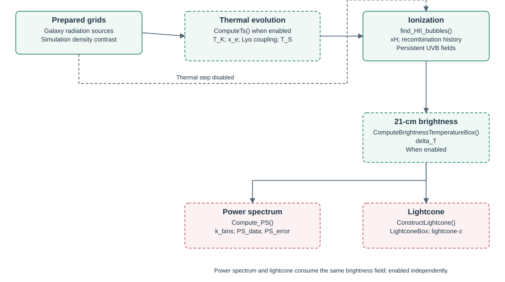

# Reionization, thermal evolution and the 21-cm signal

Meraxes couples the galaxy population to a three-dimensional, semi-numerical intergalactic medium (IGM). Galaxy positions and accumulated escaped stellar sources determine the ionization topology; time-dependent star formation and black-hole emission determine the radiation backgrounds. The ionization history then changes baryon accretion onto galaxies in later snapshots.

The original coupling is described by [Mutch et al. (2016)](https://arxiv.org/abs/1512.00562). The thermal and spin-temperature extension is described by [Balu et al. (2023)](https://arxiv.org/abs/2210.08910). The numerical methods derive from [Mesinger, Furlanetto & Cen (2011)](https://arxiv.org/abs/1003.3878) and the photoheating/recombination prescriptions of [Sobacchi & Mesinger (2013)](https://arxiv.org/abs/1301.6776) and [Sobacchi & Mesinger (2014)](https://arxiv.org/abs/1402.2298).

This page describes the CPU implementation at commit `90d8474cf41dcea646189fb86a65b7e18755ed95`. Source links are pinned to that revision. [Galaxy physics](galaxy-physics.md) describes the source population, [black holes](black-holes.md) describes AGN luminosities, [stochasticity](stochasticity.md) describes modified source assignments, and [outputs](outputs.md) documents the stored arrays and units.



## Calculation order and state

Within a snapshot, Meraxes evolves galaxies, constructs source grids, reads the simulation density field, runs the enabled thermal calculation, finds ionized cells, and calculates the enabled 21-cm products. Source and density arrays are distributed in FFTW slabs along their first axis. Galaxy ownership and FFT slab ownership need not coincide; MPI reductions combine galaxy contributions to each slab.

| Routine | Input | Result |
|---|---|---|
| `construct_baryon_grids()` | Galaxy positions and source properties | Cell sums and radiation-source histories |
| `read_grid()` | Simulation grid files | Matter overdensity and, when requested, a velocity component |
| `ComputeTs()` | Source histories, density, previous thermal state | Kinetic temperature, partial electron fraction and spin temperature |
| `find_HII_bubbles()` | Escaped sources, density, partial electrons, recombinations | Neutral fraction and ionization/UVB history |
| `ComputeBrightnessTemperatureBox()` | Density, neutral fraction, enabled spin temperature and velocities | Coeval differential brightness temperature |
| `Compute_PS()` | Coeval brightness temperature | Spherically averaged dimensional power |
| `ConstructLightcone()` | Current and previous coeval brightness cubes | Time-interpolated lightcone slices |

`xH` and `r_bubble` are initialized again during each ionization calculation. `z_at_ionization`, UVB history, cumulative recombinations and thermal histories persist across snapshots. Photoheating suppression samples the existing history before the new snapshot's radiation fields are calculated; it therefore closes the feedback loop through subsequent galaxy evolution.

## Grid assignment and source definitions

Let the box side be $L$, the grid dimension be $D=\texttt{ReionGridDim}$, and the cell volume be $V_{\rm cell}=(L/D)^3$. Here $L$ and $V_{\rm cell}$ use the code's comoving $h^{-1}$ length units until explicitly converted.

Nearest-grid-point assignment deposits each property $q_g$ into one cell:

```{math}
:label: igm-ngp
q_{ijk}=\sum_{g\in\mathcal C_{ijk}}q_g,
\qquad \delta=\rho/\bar\rho-1.
```

The actual coordinate index is `nearbyint(x / L * D)`, with an index at the upper periodic boundary wrapped to zero. This is nearest-point rounding, rather than flooring a position to a voxel index.

These source grids contain **sums per cell**. Dividing by $V_{\rm cell}$ produces a comoving source density. This distinction matters when comparing outputs at different resolutions.

The thermal helpers' present-day number-density convention counts hydrogen and helium nuclei:

```{math}
:label: igm-number-densities
\bar n_{H,0}=\frac{\Omega_b\rho_{\rm crit,0}(1-Y_{\rm He})}{m_p},
\quad \bar n_{{\rm He},0}=\frac{\Omega_b\rho_{\rm crit,0}Y_{\rm He}}{4m_p},
\quad \bar n_{b,0}=\bar n_{H,0}+\bar n_{{\rm He},0},
\quad f_H=\frac{\bar n_{H,0}}{\bar n_{b,0}},
\quad f_{\rm He}=\frac{\bar n_{{\rm He},0}}{\bar n_{b,0}}.
```

All three number densities are in $\mathrm{cm^{-3}}$. The source name `N_b0` refers to this atomic-nucleus count, rather than the proton-mass-equivalent baryon count $\rho_b/m_p$.

| Source array | Standard galaxy contribution | Physical role |
|---|---|---|
| `stars` | `FescWeightedGSM` | Accumulated escaped stellar source for UV ionization |
| `weighted_sfr` | `FescWeightedSfr` | Escaped stellar formation rate for the UV photoionization background |
| `sfr` | Instantaneous SFR, or gross stellar mass converted through a timescale | Stellar Ly$\alpha$ and thermal-source history |
| `effective_bhm` | `EffectiveBHM`, subject to `BlackHoleMassLimitReion` | Cumulative black-hole source in stellar-equivalent units |
| `effective_bhar` | `EffectiveBHAR`, subject to the same cut | Instantaneous black-hole UV source in stellar-equivalent units |
| Internal X-ray source arrays | HMXB luminosity; separate soft and hard AGN luminosities | Heating, partial ionization and secondary Ly$\alpha$ emission |

The standard stellar accumulator is

```{math}
:label: igm-stellar-accumulator
M_{\star,\mathrm{esc}}^{\rm gross}(t)
=\sum_{\rm SF\ events}\Delta M_{\star}\,f_{\rm esc},
\qquad
\dot M_{\star,\mathrm{esc}}=f_{\rm esc}\dot M_{\star}.
```

Merger bookkeeping transfers cumulative sources to the descendant. `stars` is neither the surviving stellar mass nor a photon-number cube. Conversion to ionizing photons uses `ReionNionPhotPerBary` and the efficiency below. With `USE_STOCHASTICITY`, treated source accumulators and recalibration factors may replace the standard contributions; see [stochasticity](stochasticity.md).

The thermal-source switch has the implemented meaning

```{math}
:label: igm-thermal-sfr
\dot M_{\star,X}=\begin{cases}
\dot M_{\star},&\texttt{Flag\_InstantaneousSFR}=1,\\
M_{\star}^{\rm gross}/t_{\rm sfr},&\texttt{Flag\_InstantaneousSFR}=0,
\end{cases}
\qquad t_{\rm sfr}=\texttt{ReionSfrTimescale}\,t_H(z).
```

The defaults select instantaneous SFR. The alternative is a cumulative-mass/timescale estimate. Source-history averaging during propagation is a separate operation.

Source: [`reionization.c`](https://github.com/qyx268/meraxes-devs/blob/90d8474cf41dcea646189fb86a65b7e18755ed95/src/core/reionization.c).

## Fourier filtering and ionization

### Filter kernels and radius sequence

The smoothed field is the inverse Fourier transform of the original transform multiplied by a window:

```{math}
:label: igm-filter
q_R(\boldsymbol x)=\mathcal F^{-1}
\!\left[W(kR)\,\mathcal F[q](\boldsymbol k)\right].
```

The implementation divides each forward transform by $D^3$, compensating for FFTW's unnormalized inverse transform.

| `ReionFilterType` or `TsHeatingFilterType` | Implemented window, with $u=kR$ |
|---|---|
| `0`: real-space top hat | $W(u)=3(\sin u-u\cos u)/u^3$, with $W(0)=1$ |
| `1`: Fourier-space top hat | $W(u)=1$ for $0.413566994\,u\leq1$, otherwise zero |
| `2`: Gaussian | $W(u)=\exp[-(0.643u)^2/2]$ |

The numerical rescalings equate the filter volumes to the real-space top-hat convention. The mass assigned to a radius is independently selected by `ReionRtoMFilterType`:

```{math}
:label: igm-radius-mass
M_R=\begin{cases}
\frac{4\pi}{3}\,\Omega_m\rho_{\rm crit}R^3,&\text{type }0,\\
(2\pi)^{3/2}\,\Omega_m\rho_{\rm crit}R^3,&\text{type }1.
\end{cases}
```

Ionization filtering proceeds from large to small scales,

```{math}
:label: igm-radius-sequence
R_0=\min(R_{\max},0.620350491L),\qquad
R_{n+1}=R_n/\texttt{ReionDeltaRFactor}.
```

When the next radius reaches the cell scale or `ReionRBubbleMin`, the final step uses the unsmoothed cell field. The equivalent cell radius is $0.620350491L/D$, except that the implementation uses $L/D$ when the cell side is below one internal length unit.

With `Flag_EvolvingReionRBubbleMax=1`, the CPU routine sets

```{math}
:label: igm-radius-evolution
R_{\max}(z)=\begin{cases}
25.483241248322766\ h^{-1}{\rm cMpc},&z>6,\\
112[(1+z)/5]^{-4.4}\ h^{-1}{\rm cMpc},&z\leq6.
\end{cases}
```

This is the equation present in the branch; the defaults associate the option with a Qin et al. development. A specific published citation is not established by the source. When this flag is zero, `ReionRBubbleMaxRecomb` is used if recombinations are enabled and `ReionRBubbleMax` otherwise.

### Ionizing efficiency and barrier

The stellar ionizing efficiency calculated by `set_ReionEfficiency()` is

```{math}
:label: igm-efficiency
\zeta_\star=\frac{N_{\gamma,\star}}
{f_b(1-3Y_{\rm He}/4)},\qquad f_b=\Omega_b/\Omega_m.
```

$N_{\gamma,\star}=\texttt{ReionNionPhotPerBary}$ is the number of ionizing photons per stellar baryon and $Y_{\rm He}$ is the helium mass fraction. Escape fractions are already contained in `stars`, so they are not applied again to $\zeta_\star$. The helium factor converts the baryonic-mass convention to the number-density convention used by the ionization prescription. If `Flag_IRA` is enabled, this routine additionally divides $\zeta_\star$ by `SfRecycleFraction`; this statement describes the implementation, including its choice of parameter.

Define $s_R$ and $b_R$ as the filtered escaped stellar and effective black-hole cell masses, $\delta_R$ as the filtered overdensity, and

```{math}
:label: igm-photon-budget
\mathcal B_R=
\frac{4\pi R^3}{3V_{\rm cell}M_R}
\frac{\zeta_\star(s_R+b_R)+\zeta_{\rm III}s_{R,\rm III}}
{1+\delta_R}.
```

The Pop III term is compiled only with `USE_MINI_HALOS`. The effective black-hole term is used when `Flag_BHFeedback` is enabled. Despite the internal variable name `f_coll_stars`, these are galaxy-derived stellar-source fractions rather than a halo collapse fraction multiplied by an assumed universal star-formation efficiency.

The CPU ionization condition is

```{math}
:label: igm-ionization-barrier
\mathcal B_R>(1-x_{e,R})\left[1+
\frac{N_{{\rm rec},R}}{1+\delta_R}\right].
```

$x_{e,R}$ is the filtered, thermally evolved partial electron fraction. It is set to zero in this condition if spin-temperature evolution is disabled. $N_{{\rm rec},R}$ is set to zero if recombinations are disabled. Passing the barrier sets the **central cell** to `xH = 0`; the CPU routine does not paint every cell in the filtered sphere.

At the final cell step, cells that have not passed any barrier receive

```{math}
:label: igm-partial-cell
x_{\rm HI}=\operatorname{clip}_{[0,1]}
\left(1-x_{e,\rm cell}-\mathcal B_{\rm cell}\right).
```

This partial-cell expression is implemented without the recombination factor present in the full-ionization barrier. `xH` therefore describes the large-scale UV ionization field with the thermal partial-ionization contribution; it is separate from the residual neutral fraction calculated in ionized gas below.

Filtering floors $1+\delta_R$ at a small positive tolerance and removes negative source/recombination values generated by numerical filtering. The filtered thermal electron fraction is bounded above by `0.999`.

Source: [`find_HII_bubbles.c`](https://github.com/qyx268/meraxes-devs/blob/90d8474cf41dcea646189fb86a65b7e18755ed95/src/core/find_HII_bubbles.c).

## UV background and photoheating feedback

### Local ionization rate and intensity

The code treats the successful filtering radius as a local photon mean-free-path scale. For a UV spectrum $J_\nu\propto\nu^{-\alpha}$ and cross section $\sigma_{\rm HI}\propto\nu^{-2.75}$, the corresponding physical background estimate has the form

```{math}
:label: igm-gamma
\Gamma_{\rm HI}=\sigma_{{\rm HI},0}\frac{\alpha}{\alpha+2.75}
(1+z)^2R\,\dot n_{\gamma,\rm esc}^{\rm com},
\qquad
\dot n_{\gamma,\rm esc}^{\rm com}
=\frac{N_\gamma\dot\rho_{\star,\rm esc}^{\rm com}}{m_p}.
```

Here physical cgs units must be used for $R$, the comoving photon-production density and $\sigma_{{\rm HI},0}$. Stellar, Pop III and effective black-hole rate terms are added with their respective spectra and photon yields. `Gamma12` represents $\Gamma_{\rm HI}/10^{-12}\,\mathrm{s}^{-1}$ with the code's $h$ convention; convert the stored value as documented in [outputs](outputs.md).

The UVB feedback intensity is instead estimated from accumulated source mass divided by $t_{\rm sfr}$:

```{math}
:label: igm-j21
J_{21}=10^{21}\frac{h_P\alpha}{4\pi}\,
b_\Gamma(1+z)^2R\,
\frac{N_\gamma\rho_{\star,\rm esc}^{\rm com}}{m_p t_{\rm sfr}}.
```

$h_P$ is Planck's constant, distinct from the dimensionless Hubble parameter $h$; $b_\Gamma=\texttt{ReionGammaHaloBias}$. The intensity unit is $10^{-21}\,\mathrm{erg\,s^{-1}\,cm^{-2}\,Hz^{-1}\,sr^{-1}}$. `ReionUVBFlag=1` stores this value at first ionization, whereas `ReionUVBFlag=2` updates it on subsequent successful crossings. In this CPU revision, the continuously updated intensity, `Gamma12` and `r_bubble` are assigned inside the recombinations-enabled crossing branch. This condition affects their interpretation when recombinations are disabled.

### Patchy baryon suppression

The critical halo mass follows the Sobacchi–Mesinger prescription:

```{math}
:label: igm-critical-mass
M_{\rm crit}=M_0J_{21}^{a}
\left(\frac{1+z}{10}\right)^b
\left[1-\left(\frac{1+z}{1+z_{\rm ion}}\right)^c\right]^d,
\quad z<z_{\rm ion}.
```

It is zero before the cell's first recorded ionization. The default exponents are $(a,b,c,d)=(0.17,-2.1,2,2.5)$. `ReionSMParam_m0` supplies $M_0$ in internal mass units; its default is `0.18984`. The implementation converts the stored intensity through $J_{21}^{\rm phys}=h^2J_{21}^{\rm code}$ before using this equation.

The modifier of the cosmic baryon fraction is

```{math}
:label: igm-baryon-modifier
f_{\rm mod}=2^{-M_{\rm crit}/M_{\rm vir}},\qquad
M_{b,\rm target}=f_bf_{\rm mod}M_{\rm vir}.
```

Thus $M_{\rm vir}=M_{\rm crit}$ retains half the cosmic baryon fraction. This modifier enters the galaxy infall prescription, rather than directly changing the dark-matter halo mass.

### Homogeneous alternatives

`Flag_ReionizationModifier=0` returns unity. With coupled patchy reionization active, a nonzero modifier selects the cell-history formula above. Otherwise the three implemented alternatives are:

| Value | Prescription |
|---|---|
| `1` | Homogeneous Sobacchi–Mesinger transition using a redshift-dependent minimum mass |
| `2` | Gnedin filtering-mass model using the Kravtsov et al. fitting expression |
| `3` | A supplied, precomputed `MvirCrit[snapshot]` curve with the same exponential suppression |

The homogeneous transition is

```{math}
:label: igm-homogeneous-sobacchi
g(z)=\left[1+\exp\!\left(
\frac{z-(z_{\rm re}-\Delta z_{\rm sc})}{\Delta z_{\rm re}}
\right)\right]^{-1},\qquad
M_{\min}=M_{\rm cool}\left(\frac{M_0(z)}{M_{\rm cool}}\right)^{g(z)}.
```

$M_{\rm cool}$ and $M_0(z)$ are obtained from `ReionTcool` and `ReionSobacchi_T0` through the virial temperature–mass conversion. This alternative uses $f_{\rm mod}=2^{-M_{\min}/M_{\rm vir}}$.

For the Gnedin option,

```{math}
:label: igm-gnedin
M_F=M_J[f(a)]^{3/2},\qquad
M_J=25\,\Omega_m^{-1/2}\,2.21
\quad[10^{10}h^{-1}M_\odot],\qquad
f_{\rm mod}=\left[1+0.26
\frac{\max(M_F,M_{\rm cool})}{M_{\rm vir}}\right]^{-3}.
```

Set $a=(1+z)^{-1}$, $a_0=(1+z_0)^{-1}$, $a_r=(1+z_r)^{-1}$, and $\alpha_G=6$. The actual piecewise fitting function is

```{math}
:label: igm-gnedin-filter
f(a)=\begin{cases}
\displaystyle\frac{3a}{(2+\alpha_G)(5+2\alpha_G)}
\left(\frac a{a_0}\right)^{\alpha_G},&a\leq a_0,\\[5pt]
\displaystyle\frac3a\left\{
a_0^2\left[\frac1{2+\alpha_G}-\frac{2(a/a_0)^{-1/2}}{5+2\alpha_G}\right]
+\frac{a^2}{10}-\frac{a_0^2}{10}\left[5-4(a/a_0)^{-1/2}\right]
\right\},&a_0<a<a_r,\\[5pt]
\displaystyle\frac3a\left\{
a_0^2\left[\frac1{2+\alpha_G}-\frac{2(a/a_0)^{-1/2}}{5+2\alpha_G}\right]
+\frac{a_r^2}{10}\left[5-4(a/a_r)^{-1/2}\right]
-\frac{a_0^2}{10}\left[5-4(a/a_0)^{-1/2}\right]
+\frac{aa_r}{3}-\frac{a_r^2}{3}\left[3-2(a/a_r)^{-1/2}\right]
\right\},&a\geq a_r.
\end{cases}
```

Source: [`physics/reionization.c`](https://github.com/qyx268/meraxes-devs/blob/90d8474cf41dcea646189fb86a65b7e18755ed95/src/physics/reionization.c). These alternatives are separate from the source-assignment stochasticity switches.

## Recombination sinks and self-shielding

### Subgrid density distribution

With `Flag_IncludeRecombinations=1`, Meraxes integrates over the Miralda-Escudé–Haehnelt–Rees density distribution. In the implemented notation,

```{math}
:label: igm-mhr-pdf
P_V(\Delta)=A\exp\!\left[
-\frac{(\Delta^{-2/3}-C_0)^2}{2(2\delta_0/3)^2}
\right]\Delta^{\beta},\qquad \delta_0=\frac{7.61}{1+z_{\rm eff}}.
```

$\Delta$ is a subgrid overdensity; $A,C_0,\beta$ are the normalization and redshift-dependent table values. The code's $\beta$ values are negative. The cell's resolved density is represented through

```{math}
:label: igm-effective-redshift
1+z_{\rm eff}=(1+z)(1+\delta)^{1/3}.
```

### Self-shielded ionization equilibrium

The attenuation fit follows [Rahmati et al. (2013)](https://arxiv.org/abs/1210.7808):

```{math}
:label: igm-self-shielding
\Delta_{\rm ss}=26.7T_4^{0.17}
\left(\frac{1+z_{\rm eff}}{10}\right)^{-3}
\Gamma_{12}^{2/3},
\qquad
\frac{\Gamma_{\rm ss}}{\Gamma_{\rm bg}}=
0.98\left[1+\left(\frac\Delta{\Delta_{\rm ss}}\right)^{1.64}\right]^{-2.28}
+0.02\left[1+\frac\Delta{\Delta_{\rm ss}}\right]^{-0.84}.
```

$T_4=T/(10^4\,\mathrm K)$ and $\Gamma_{12}=\Gamma_{\rm bg}/(10^{-12}\,\mathrm{s}^{-1})$. For each subgrid density the hydrogen neutral fraction $\chi$ satisfies

```{math}
:label: igm-equilibrium-neutral
\Gamma_{\rm ss}\chi=
\alpha_B(T)n_H(1+c_{\rm He})(1-\chi)^2,
\qquad c_{\rm He}=\frac{Y_{\rm He}}{4-3Y_{\rm He}},
\qquad
\alpha_B(T)=\alpha_{B,10^4}\left(\frac T{10^4\,\mathrm K}\right)^{-0.75}.
```

The adopted case-B normalization is $\alpha_{B,10^4}=2.59\times10^{-13}\,\mathrm{cm^3\,s^{-1}}$. $c_{\rm He}$ is the correction coded in `neutral_fraction()`.

The physical root is evaluated from the quadratic, with the small-$\chi$ approximation used below $10^{-5}$ to avoid cancellation. The density-integrated quantities are

```{math}
:label: igm-recombination-integrals
\begin{aligned}
\mathcal R&=\alpha_B(T)\bar n_H(z_{\rm eff})
\int_{0.01}^{200}P_V(\Delta)\Delta^2[1-\chi(\Delta)]^2\,d\Delta,\\
C_{\rm HII}&=
\frac{\int_{0.01}^{200}P_V(\Delta)\Delta^2[1-\chi(\Delta)]^2d\Delta}
{\left[\int_{0.01}^{200}P_V(\Delta)\Delta[1-\chi(\Delta)]d\Delta\right]^2},\\
x_{\rm HI,res}^{\rm phys}&=
\int_{0.01}^{200}P_V(\Delta)\chi(\Delta)d\Delta.
\end{aligned}
```

$\mathcal R$ has units $\mathrm{s}^{-1}$. The stored `residual_xH` is **$10^4x_{\rm HI,res}^{\rm phys}$** in this implementation; it should not be added directly to `xH` without conversion and an explicitly chosen physical combination. `clumping_factor` is dimensionless.

The cumulative sink and relaxation time update are

```{math}
:label: igm-recombination-update
N_{\rm rec}^{i+1}=N_{\rm rec}^{i}
+\mathcal R_i\,\left|\frac{dt}{dz}\right|_i
(z_{i-1}-z_i)(1-x_{{\rm HI},i}),
\qquad t_{\rm resp}=\frac1{\Gamma_{\rm HI}+\mathcal R}.
```

`t_resp` is stored in Myr. A nonpositive rate returns the large sentinel `1e30`. `Flag_TemperatureDependentRec=1` uses `temp_kinetic_all_gas`; otherwise the recombination temperature is fixed at $10^4\,\mathrm K$.

### Interpolation tables

The branch generates or loads recombination tables from `RecombinationDir`. The grid is $z_{\rm eff}=0,0.2,\ldots,39.8$, $\log_{10}(T/\mathrm K)=2,2.03,\ldots,4.97$, and $\ln\Gamma_{12}=-10,-9.9,\ldots,4.9$. It selects the nearest redshift and temperature index and performs cubic-spline interpolation in $\ln\Gamma_{12}$; this is not trilinear interpolation.

At temperatures below the table or $\ln\Gamma_{12}<-10$, the return values are zero recombination rate, `residual_xH = 1e4`, and clumping factor one. Upper-temperature and upper-ionization-rate arguments are bounded to the table. These boundary rules are relevant when interpreting cells with little or no UVB.

Source: [`recombinations.c`](https://github.com/qyx268/meraxes-devs/blob/90d8474cf41dcea646189fb86a65b7e18755ed95/src/core/recombinations.c) and [`recombinations.h`](https://github.com/qyx268/meraxes-devs/blob/90d8474cf41dcea646189fb86a65b7e18755ed95/src/core/recombinations.h).

## Radiation propagation and X-ray deposition

### Source spectra and retarded emission

Galaxy X-ray emission is normalized by

```{math}
:label: igm-hmxb-luminosity
L_{X,\rm gal}=(L_X/\mathrm{SFR})\dot M_{\star,X},
\qquad L_\nu\propto\nu^{-\alpha_X}.
```

The default soft-band normalization is `LXrayGal = 3.16e40` in $\mathrm{erg\,s^{-1}}/(M_\odot\,\mathrm{yr^{-1}})$, $\alpha_X=1$, and the host-galaxy escape threshold is $E_0=500\,\mathrm{eV}$. The soft-band boundary is $2\,\mathrm{keV}$, and integration extends to `NuXrayMax = 10000` eV. Despite the `Nu` parameter prefix, these three input parameters are **energies in eV**, converted to frequencies internally. AGN soft and hard components have their own normalizations and slopes; see [black holes](black-holes.md).

For a band $[\nu_a,\nu_b]$, its energy-spectrum normalization is determined by

```{math}
:label: igm-spectral-normalization
L_\nu=A_X\nu^{-\alpha_X},\qquad
A_X=\frac{L_{[a,b]}}{I_\alpha},\qquad
I_\alpha=\begin{cases}
\displaystyle\frac{\nu_b^{1-\alpha_X}-\nu_a^{1-\alpha_X}}{1-\alpha_X},&\alpha_X\ne1,\\
\ln(\nu_b/\nu_a),&\alpha_X=1.
\end{cases}
```

The continuum interpretation of retarded radiation is

```{math}
:label: igm-radiation-integral
J_\nu(\boldsymbol x,z)=\frac{c(1+z)^3}{4\pi}
\int_z^\infty\left|\frac{dt}{dz'}\right|
\epsilon_{\nu'}^{\rm com}(\boldsymbol x,z')
e^{-\tau_X(\nu,z,z')}dz',
\qquad\nu'=\nu\frac{1+z'}{1+z}.
```

$\epsilon_{\nu'}^{\rm com}$ is the shell-averaged comoving energy emissivity. The code approximates the attenuation by an optically thick/thin threshold and computes shell integrals from smoothed source histories rather than ray tracing individual sources.

The shells extend from an equivalent cell radius to the fixed `R_XLy_MAX = 500` cMpc, using `TsNumFilterSteps` logarithmically spaced radii. `TsHeatingFilterType` selects the spatial kernel. Snapshot histories are time weighted over the retarded-emission interval intersecting each shell. Increasing shell count changes both memory use and radiation quadrature resolution.

### Optical depth and absorption cutoff

The species-weighted absorption cross section is

```{math}
:label: igm-xray-crosssection
\widetilde\sigma_X(\nu,x_e)=
f_H(1-x_e)\sigma_{\rm HI}(\nu)
+f_{\rm He}(1-x_e)\sigma_{\rm HeI}(\nu)
+f_{\rm He}x_e\sigma_{\rm HeII}(\nu).
```

The hydrogenic H I and He II cross sections are evaluated as

```{math}
:label: igm-hydrogenic-crosssection
\sigma_Z(\nu)=\frac{6.3\times10^{-18}}{Z^2}
\left(\frac{\nu_Z}{\nu}\right)^4
\frac{\exp[4-4\arctan(\epsilon)/\epsilon]}
{1-\exp[-2\pi/\epsilon]} \mathrm{cm^2},
\qquad \epsilon=\sqrt{\nu/\nu_Z-1},\quad Z=1,2.
```

Each cross section is zero below its threshold; the thresholds are 13.60 eV for H I and 54.40 eV for He II. The He I fit uses its 24.59 eV threshold and

```{math}
:label: igm-helium-crosssection
x=\frac{h_P\nu}{13.61\,\mathrm{eV}}-0.4434,
\qquad y=\sqrt{x^2+2.136^2},\qquad
\sigma_{\rm HeI}=9.492\times10^{-16}
[(x-1)^2+2.039^2]y^{3.188/2-5.5}
\left(1+\sqrt{y/1.469}\right)^{-3.188}\ \mathrm{cm^2}.
```

$f_H,f_{\rm He}$ are the hydrogen and helium atomic number fractions in Equation {eq}`igm-number-densities`. Hydrogen and helium are assumed to share the same ionization state in this approximation. The optical depth is

```{math}
:label: igm-xray-optical-depth
\tau_X(\nu,z,z')=
\int_z^{z'}c\left|\frac{dt}{dz''}\right|
\bar n_b(z'')\,Q_{\rm HI}(z'')\,
\widetilde\sigma_X\!\left(\nu\frac{1+z''}{1+z},\bar x_e\right)dz''.
```

The code estimates $Q_{\rm HI}$ from stored stellar-source fractions and ionizing efficiencies, using the current mean partial-electron fraction and flooring $Q_{\rm HI}$ at $10^{-4}$. It finds $\nu_{\tau=1}$ with a Brent root solver. The integration lower bound is the larger of the spectral escape threshold and $\nu_{\tau=1}$; AGN band edges are also redshifted from emission to absorption. Thus the frequency integral excludes radiation treated as absorbed before reaching the shell. This is a step approximation to $e^{-\tau_X}$.

### Heating, ionization and secondary Ly$\alpha$

For species $s$, let its threshold be $\nu_s$, electron energy be $E_s=h_P(\nu-\nu_s)$, number weight be $a_s$, and photoionization cross section be $\sigma_s$. The implemented frequency kernels can be written as

```{math}
:label: igm-xray-kernels
\begin{aligned}
K_{\rm heat}&=\int_{\nu_{\rm lo}}^{\nu_{\rm hi}}
\left(\frac\nu{\nu_0}\right)^{-\alpha_X-1}
\sum_s a_s\sigma_s(\nu)E_s f_{\rm heat}(E_s,x_e)d\nu,\\
K_{\rm ion}&=\int_{\nu_{\rm lo}}^{\nu_{\rm hi}}
\left(\frac\nu{\nu_0}\right)^{-\alpha_X-1}
\sum_s a_s\sigma_s(\nu)
\left[1+N_{\rm ion,HI}+N_{\rm ion,HeI}+N_{\rm ion,HeII}\right]d\nu,\\
K_{\alpha}&=\frac{c}{4\pi\nu_\alpha H(z)}
\int_{\nu_{\rm lo}}^{\nu_{\rm hi}}
\left(\frac\nu{\nu_0}\right)^{-\alpha_X-1}
\sum_s a_s\sigma_s(\nu)N_\alpha(E_s,x_e)d\nu.
\end{aligned}
```

The species weights are those in Equation {eq}`igm-xray-crosssection`. The deposited-energy fraction and secondary-photon counts come from interpolation tables, rather than a constant energy split. The primary ionization is the explicit `1` in $K_{\rm ion}$. The branch interpolates across 14 electron-fraction samples and 258 electron-energy samples.

For each component $b$ (galaxy HMXB, Pop III, soft AGN, hard AGN) and deposition channel $q$, the discrete shell sum has the structure

```{math}
:label: igm-xray-shell-sum
\mathcal D_{q,b}(\boldsymbol x,z)=
g_q\mathcal A_b(z)\sum_j
\left(\frac{dt}{dz'}\Delta z'\right)_j
S_{b,j}(\boldsymbol x)(1+z'_j)^{-\alpha_b}
K_{q,b,j}(x_e),
\qquad
\mathcal A_b(z)=\frac{c(1+z)^{\alpha_b+3}}{h_P\nu_0^{\alpha_b+1}I_{\alpha_b}},
\qquad g_{\rm heat}=g_{\rm ion}=1,
\quad g_\alpha=n_b.
```

$S_{b,j}$ is the shell-averaged band luminosity per comoving $\mathrm{cm^3}$, in $\mathrm{erg\,s^{-1}\,cm^{-3}}$; $I_{\alpha_b}$ is the band integral in Equation {eq}`igm-spectral-normalization`, and $\nu_0$ is the frequency corresponding to `NuXrayThreshold`. The stellar SFR grids are converted to this luminosity density with $L_X/\mathrm{SFR}$ and the seconds-per-year factor. AGN grids already contain their band luminosities. The code uses negative shell redshift increments and negative $dt/dz'$, giving positive shell time weights. The additional $n_b$ factor for Ly$\alpha$ converts deposited photons per baryon to the local photon production used in its intensity kernel.

With stochasticity compiled, the HMXB source is a luminosity grid and `LXrayGal` is already incorporated during construction. It must not be multiplied into the heating normalization twice.

Source: [`ComputeTs.c`](https://github.com/qyx268/meraxes-devs/blob/90d8474cf41dcea646189fb86a65b7e18755ed95/src/core/ComputeTs.c) and [`XRayHeatingFunctions.c`](https://github.com/qyx268/meraxes-devs/blob/90d8474cf41dcea646189fb86a65b7e18755ed95/src/core/XRayHeatingFunctions.c).

## Kinetic temperature and partial ionization

### Initial conditions

At and above `ReionMaxHeatingRedshift`, the residual electron fraction and mean temperature come from `recfast_LCDM.dat`. The temperature includes linear adiabatic fluctuations:

```{math}
:label: igm-thermal-initial
x_e(\boldsymbol x,z)=\bar x_{e,\rm RECFAST}(z),\qquad
T_K(\boldsymbol x,z)=\bar T_{K,\rm RECFAST}(z)[1+c_T(z)\delta(\boldsymbol x,z)],
\qquad c_T(z)=0.58-0.006(z-10).
```

The source cites the linear approximation's validity over approximately $6\lesssim z\lesssim50$. Ly$\alpha$ coupling is initialized to zero; collisions still contribute to the spin temperature.

### Expansion and growth helpers

The thermal module uses its own cosmological helper functions. Its Hubble rate and analytic time derivative are

```{math}
:label: igm-expansion-helpers
H_X(z)=H_0\sqrt{\Omega_m(1+z)^3+\Omega_r(1+z)^4+\Omega_\Lambda},
\qquad
\left(\frac{dt}{dz}\right)_X=
-\frac{\sqrt{\Omega_m+\Omega_\Lambda}}
{H_0(1+z)\sqrt{\Omega_m(1+z)^3+\Omega_\Lambda}}.
```

$H_0=100h\,\mathrm{km\,s^{-1}\,Mpc^{-1}}$, converted to $\mathrm{s}^{-1}$. The second expression is the algebraic form of the implemented positive-$\Omega_m$, positive-$\Omega_\Lambda$ formula. It neglects radiation and curvature even though the first helper includes radiation. These helpers should therefore not be interpreted as a general cosmology interface.

For the nearly flat, $w_\Lambda=-1$ case, the normalized growth fit is

```{math}
:label: igm-growth-flat
D(z)=\frac{g[\Omega_m(z)]}{g(\Omega_m)(1+z)},
\qquad
\Omega_m(z)=\frac{\Omega_m(1+z)^3}
{\Omega_\Lambda+\Omega_m(1+z)^3+\Omega_r(1+z)^4},
\qquad
g(u)=\frac{2.5u}{1/70+u(209-u)/140+u^{4/7}}.
```

The Einstein–de Sitter branch returns $D=(1+z)^{-1}$. For an open, zero-$\Lambda$ cosmology the additional branch uses

```{math}
:label: igm-growth-open
D(z)=\frac{F[x(z)]}{F(x_0)},\qquad
x_0=\Omega_m^{-1}-1,\quad x(z)=\frac{|\Omega_m^{-1}-1|}{1+z},
\qquad
F(x)=1+\frac3x+
\frac{3\sqrt{1+x}}{x^{3/2}}
\ln[\sqrt{1+x}-\sqrt x].
```

`ddicke_dz()` evaluates $D'(z)$ with a forward finite difference of $10^{-10}$ in redshift. Unsupported growth branches return `-1` and print a diagnostic; the constant-$w_\Lambda\ne-1$ case is not implemented. These are source boundaries relevant to the thermal adiabatic term, rather than new cosmological assumptions to add to a run.

### Governing evolution equations

The evolved thermal electron fraction is the partial-ionization state of the gas before the large-scale UV barrier is applied. It is not generally equal to $1-\texttt{xH}$.

The implemented electron-fraction equation is

```{math}
:label: igm-electron-evolution
\frac{dx_e}{dz}=\frac{dt}{dz}
\left[\sum_b\mathcal I_{X,b}
-\alpha_A(T_K)C_Xx_e^2f_Hn_b\right],\qquad C_X=2,
\quad n_b=\bar n_{b,0}(1+z)^3(1+\delta).
```

$\mathcal I_{X,b}$ is the deposited ionization-source rate per baryon from the shell calculation. `CLUMPING_FACTOR = 2` belongs to this thermal equation; it is distinct from the density-integrated `clumping_factor` used by the UV recombination calculation.

The temperature equation is

```{math}
:label: igm-temperature-evolution
\frac{dT_K}{dz}=
\frac{2}{3k_B(1+x_e)}\frac{dt}{dz}\sum_b\epsilon_{X,b}
-\frac{T_K}{1+x_e}\frac{dx_e}{dz}
+\frac23T_K\left[\frac3{1+z}
+\frac{D'(z)}{1/\delta+D(z)}\right]
+\left.\frac{dT_K}{dz}\right|_{\rm C}.
```

$\epsilon_{X,b}$ is deposited heat in $\mathrm{erg\,s^{-1}}$ per baryon; $D(z)$ is the growth function and the displayed density term is the expression used in `evolveInt()`. The four terms describe X-ray heating, the changing particle count, adiabatic expansion/structure evolution, and Compton exchange with the CMB. The density term is omitted when $|\delta|$ is below the numerical tolerance.

The continuum Compton term and its implemented fitting form are

```{math}
:label: igm-compton
\left.\frac{dT_K}{dt}\right|_{\rm C}
=\frac{8\sigma_Ta_RT_{\rm CMB}^4}{3m_ec}
\frac{x_e}{1+x_e+f_{\rm He}}(T_{\rm CMB}-T_K),
```

```{math}
:label: igm-compton-fit
\left.\frac{dT_K}{dz}\right|_{\rm C}
=-1.51\times10^{-4}
\frac{x_e}{1+x_e+f_{\rm He}}
\frac{T_{\rm CMB}^4(T_{\rm CMB}-T_K)}
{hE(z)(1+z)},\quad E(z)=H(z)/H_0,
\quad T_{\rm CMB}=T_{\rm CMB,0}(1+z).
```

The coefficient in the fitting expression assumes temperature in K and the routine's Hubble convention. The case-A coefficient uses $u=\ln[T/(1.1604505\times10^4\,\mathrm K)]$:

```{math}
:label: igm-alpha-a
\alpha_A(T)=\exp\!\left(\sum_{j=0}^{9}a_ju^j\right)
\quad[\mathrm{cm^3\,s^{-1}}],
```

with coefficients

```text
a0 = -28.6130338       a1 = -0.72411256
a2 = -2.02604473e-2    a3 = -2.38086188e-3
a4 = -3.21260521e-4    a5 = -1.42150291e-5
a6 =  4.98910892e-6    a7 =  5.75561414e-7
a8 = -1.85676704e-8    a9 = -3.07113524e-9
```

### Discrete update and temperature protection

The shell radiation integral and the thermal time update are distinct. `ComputeTs()` evaluates the derivatives once at the current snapshot and advances by a forward-Euler redshift step:

```{math}
:label: igm-euler-update
x_e^{i+1}=x_e^i+\left(\frac{dx_e}{dz}\right)_i\Delta z,
\qquad T_K^{i+1}=T_K^i+\left(\frac{dT_K}{dz}\right)_i\Delta z,
\qquad\Delta z=z_i-z_{i-1}<0.
```

Electron fractions are clipped to $[0,1-\varepsilon]$. A temperature below `MIN_TK = 0.1` K is replaced by the current CMB temperature. The derivative update is skipped for a pre-update temperature at or above `MAX_TK = 5e4` K; this is an update guard, not a strict upper clipping bound. Snapshot cadence therefore controls thermal integration accuracy.

The `volume_ave_Xheat` attributes report the X-ray contribution to **$dT_K/dz$**, including soft/hard AGN contributions when enabled. `volume_ave_Xion` reports the X-ray **source** contribution to $dx_e/dz$, excluding the recombination sink. These are signed redshift derivatives, not temperatures, luminosities or positive rates per second.

## Ly$\alpha$ coupling and spin temperature

The spin temperature balances CMB, collisions and Wouthuysen–Field coupling:

```{math}
:label: igm-spin-temperature
T_S^{-1}=\frac{T_{\rm CMB}^{-1}
+\widetilde x_\alpha T_{c,\rm eff}^{-1}
+x_cT_K^{-1}}{1+\widetilde x_\alpha+x_c}.
```

The collision term includes neutral hydrogen, electrons and protons:

```{math}
:label: igm-collision-coupling
x_c=\frac{T_\star}{A_{10}T_{\rm CMB}}
\left[n_{\rm HI}\kappa_{10}^{\rm HH}(T_K)
+n_e\kappa_{10}^{\rm eH}(T_K)
+n_p\kappa_{10}^{\rm pH}(T_K)\right],
\quad T_\star=0.0628\,\mathrm K,
\quad A_{10}=2.85\times10^{-15}\,\mathrm{s}^{-1}.
```

The collision coefficients are temperature-dependent interpolation fits in `XRayHeatingFunctions.c`. The effective Ly$\alpha$ coupling is

```{math}
:label: igm-alpha-coupling
\widetilde x_\alpha=\frac{1.66\times10^{11}}{1+z}
\widetilde S_\alpha J_\alpha,
\qquad J_\alpha=J_{\alpha,\star}+J_{\alpha,X},
```

where $J_\alpha$ is a photon-number specific intensity in $\mathrm{photons\,cm^{-2}\,s^{-1}\,Hz^{-1}\,sr^{-1}}$. Direct stellar UV emission is integrated over the past lightcone, summing photons that redshift into the Lyman series and cascade into Ly$\alpha$:

```{math}
:label: igm-stellar-alpha
J_{\alpha,\star}(\boldsymbol x,z)=
\frac{c(1+z)^2}{4\pi}
\sum_{n=2}^{23}f_{\rm rec}(n)
\int_z^{z_{\max}(n)}
\frac{\epsilon_{\nu'_n}^{\rm photon,com}(\boldsymbol x,z')}{H(z')}dz',
\qquad
\nu'_n=\nu_n\frac{1+z'}{1+z}.
```

The continuum equation expresses the shell sum used in the code. The upper limit is set by the next Lyman resonance, and tabulated stellar spectra set the emissivity:

```{math}
:label: igm-lyman-horizon
1+z_{\max}(n)=(1+z)\frac{1-(n+1)^{-2}}{1-n^{-2}},
\qquad \frac{\nu_n}{\nu_\alpha}=\frac{1-n^{-2}}{3/4}.
```

The recycling fractions include $f_{\rm rec}(2)=1$, $f_{\rm rec}(3)=0$ and higher-level cascade probabilities. Secondary X-ray Ly$\alpha$ is supplied by $K_\alpha$ above.

The implemented spectral-distortion/color-temperature correction is

```{math}
:label: igm-alpha-correction
\begin{aligned}
\xi&=(10^{-7}\tau_{\rm GP}/T_K^2)^{1/3},\\
\widetilde S_\alpha&=
\frac{1-0.0631789/T_K+0.115995/T_K^2
-0.401403/(T_ST_K)+0.336463/(T_ST_K^2)}
{1+2.98394\xi+1.53583\xi^2+3.85289\xi^3},\\
T_{c,\rm eff}^{-1}&=T_K^{-1}
+\frac{0.405535}{T_K}(T_S^{-1}-T_K^{-1}),\\
\tau_{\rm GP}&=\frac{1.342881\times10^{-7}}{H(z)}
\bar n_{H,0}(1+z)^3(1+\delta)(1-x_e).
\end{aligned}
```

Temperatures are in K and $H(z)$ is in $\mathrm{s}^{-1}$ in these fits. Because the corrections depend on $T_S$, the routine iterates until its fractional change is below $10^{-3}$. If $J_\alpha\leq10^{-20}$, it uses the collisions-only solution.

Setting `Flag_IncludeSpinTemp=0` bypasses this thermal/spin calculation for the 21-cm signal and assumes $T_S\gg T_{\rm CMB}$. It does not remove the UV ionization calculation.

## Photoionized-gas temperature

`temp_kinetic_all_gas` tracks the temperature used by temperature-dependent UV recombinations. It differs from `Tk_box`, which belongs to the X-ray/neutral-gas calculation.

For a fully ionized cell with first ionization redshift $z_r$, the implementation uses a thermal-memory expression motivated by the McQuinn–Upton Sanderbeck treatment:

```{math}
:label: igm-ionized-temperature
\begin{aligned}
\delta_r&=\delta\frac{1+z}{1+z_r},\\
T_{\rm HII}&=\left\{
T_{\rm re}^{1.7}
\left(\frac{1+\delta}{1+\delta_r}\right)^{1.1333}
\left(\frac{1+z}{1+z_r}\right)^{3.4}
\exp\!\left[\left(\frac{1+z}{7.1}\right)^{2.5}
-\left(\frac{1+z_r}{7.1}\right)^{2.5}\right]
+\left[10^4\frac{1+z}{4}\right]^{1.7}(1+\delta)
\right\}^{0.5882}.
\end{aligned}
```

`T_RE` is $10^4\,\mathrm K$. At first ionization, the first term's evolution factor is set to one. Both $\delta$ and the extrapolated $\delta_r$ are bounded above the negative-density singularity. The routine imposes the neutral/X-ray kinetic temperature as a lower bound afterward.

For the partial-cell branch the mixture prescription is

```{math}
:label: igm-partial-temperature
T_{\rm mix}=x_{\rm HI}T_{\rm HI}+(1-x_{\rm HI})T_{\rm re}.
```

In the current CPU loop this mixture is evaluated **before** the final partial-cell `xH` assignment, using the cell's then-current neutral value. The displayed prescription therefore describes the function, while operation order determines which value it receives. [Davies et al. (2019), thermal memory of reionization](https://academic.oup.com/mnras/article/489/1/977/5549525) provides related Meraxes context; the pinned formula above is the authority for this branch.

## Optional minihalo and Lyman–Werner coupling

With `USE_MINI_HALOS`, separate Pop III source terms are added to ionization, X-ray heating and stellar Ly$\alpha$. The thermal routines also maintain comparison arrays labeled `II`, which remove explicit Pop III heating/stellar-background terms while sharing other parts of the calculation. They are not a complete rerun of galaxy evolution and ionization with Pop III removed.

If `Flag_IncludeLymanWerner=1`, the branch computes stellar, Pop III and enabled AGN Lyman–Werner backgrounds.

The Lyman–Werner band spans 11.2–13.6 eV. Its propagation uses the same retarded source shells, but counts continuum photons between Lyman resonances without a Ly$\alpha$ recycling factor. For a shell with emission redshift $z'$, the stellar band factor is

```{math}
:label: igm-lw-band
\Phi_{{\rm LW},\star}(z,z')=
\sum_{n=2}^{23}\int_{u_{\rm lo}}^{u_{n+1}}
u\,\epsilon_{u,\star}^{\rm photon}\,du,
\qquad u=\nu/\nu_\alpha,\quad
u_{\rm lo}=\max[u_n(1+z')/(1+z),\nu_{\rm LW}/\nu_\alpha],
\qquad z'\leq z_{\max}(n),
```

with a zero contribution if the lower edge exceeds the upper edge. The additional factor of $u$ weights photon number by photon energy. For a spectral segment $\epsilon_u=N_0u^{\alpha_S}$, the returned band term is $N_0[u_{n+1}^{\alpha_S+2}-u_{\rm lo}^{\alpha_S+2}]/(\alpha_S+2)$. Stellar spectra are normalized per stellar baryon. The shell source calculation has the implemented structure

```{math}
:label: igm-lw-shell
F_{{\rm LW},\star}=\frac{c}{4\pi m_p}
(1+z)^2\sum_j\dot\rho_{\star,j}^{\rm com}
(1+z'_j)\left(\frac{dt}{dz'}\Delta z'\right)_j
\Phi_{{\rm LW},\star,j}.
```

Consistent stellar-mass units are required in the factor $\dot\rho_\star/m_p$. The routine converts the stellar photon flux to a band-averaged energy intensity using $h_P\nu_\alpha/(\nu_{\rm ion}-\nu_{\rm LW})$ and adds its separately normalized AGN energy contribution. AGN sources are `QuasarLuv` with the `SpecIndexUVAGNSoft` continuum slope and `AGNLWEfficiency` multiplier. Their LW activation depends on `Flag_IncludeLymanWerner`, independently of `Flag_IncludeAGNXray`; turning off AGN X-rays does not by itself turn off AGN LW photons. [Optional physics](optional-physics.md) gives the AGN spectral normalization and the molecular-cooling response.

The molecular-cooling critical mass is

```{math}
:label: igm-lw-critical-mass
M_{\rm crit,MC}=M_{\rm cool,SV}(z)
\left[1+6.96(4\pi J_{\rm LW})^{0.47}\right].
```

The input to this fitting expression is the code's `JLW_box` intensity convention. Streaming velocities modify the baseline circular-velocity threshold:

```{math}
:label: igm-streaming-cooling
v_{bc}=n\,30\frac{1+z}{1000}\ \mathrm{km\,s^{-1}},
\qquad
V_{\rm cool}=\sqrt{(3.714\ \mathrm{km\,s^{-1}})^2+(4.015v_{bc})^2},
\qquad
M_{\rm cool,SV}=M_{
\rm vir}(V_{\rm cool},z).
```

The current minihalo feedback path uses $n=1$ when `Flag_IncludeStreamVel` is enabled and $n=0$ otherwise; it does not load a spatially varying streaming-velocity realization in this function. See [optional physics](optional-physics.md) for Pop III formation, IMF, enrichment and the LW threshold response.

Sources: [`physics/reionization.c`](https://github.com/qyx268/meraxes-devs/blob/90d8474cf41dcea646189fb86a65b7e18755ed95/src/physics/reionization.c), [`cooling.c`](https://github.com/qyx268/meraxes-devs/blob/90d8474cf41dcea646189fb86a65b7e18755ed95/src/core/cooling.c).

## Differential 21-cm brightness

### No peculiar velocities

The optically thin coeval signal is

```{math}
:label: igm-brightness
\delta T_b(\boldsymbol x,z)=T_0(z)x_{\rm HI}(1+\delta)
\left(1-\frac{T_{\rm CMB}}{T_S}\right),
\qquad
T_0(z)=27\left(\frac{\Omega_bh^2}{0.023}\right)
\left[\frac{0.15}{\Omega_mh^2}\frac{1+z}{10}\right]^{1/2}
\mathrm{mK}.
```

The code evaluates $\Omega_b=\Omega_m\,\texttt{BaryonFrac}$ and uses the simulation matter-density contrast as the baryonic-density contrast. With spin temperature disabled, it sets the last factor to one. Positive $\delta T_b$ is emission relative to the CMB; negative $\delta T_b$ is absorption.

### Peculiar-velocity options

| `Flag_IncludePecVelsFor21cm` | Implemented operation when spin-temperature evolution is enabled |
|---|---|
| `0` | No velocity correction |
| `1` | Optically thin velocity-gradient correction, capped at $0.2H$ |
| `2` | Finite-optical-depth brightness with the uncapped velocity gradient |
| `3` | Option 2 followed by subcell redistribution along the line of sight |

For option 1,

```{math}
:label: igm-velocity-thin
\delta T_b^{v}=\frac{\delta T_b}{1+g_v/H(z)},\qquad
g_v=\operatorname{clip}_{[-0.2H,0.2H]}
\left(\frac{\partial v_{\parallel,\rm com}}{\partial r_{\parallel,\rm com}}\right).
```

The gradient is calculated by a Fourier derivative of the selected velocity component. Tree-format-specific input conversions are applied before the physical/comoving velocity conversion. `TsVelocityComponent` selects the input component; its default is `3` (Z).

Options 2 and 3 use the finite optical-depth expression

```{math}
:label: igm-velocity-thick
\tau_{21}=\frac{T_0x_{\rm HI}(1+\delta)(1+z)}
{1000T_S\,|1+g_v/H|},\qquad
\delta T_b^{v}=\frac{1000(T_S-T_{\rm CMB})}{1+z}
\left(1-e^{-\tau_{21}}\right)\ \mathrm{mK}.
```

In $\tau_{21}$, $T_0$ is evaluated numerically in mK, and the factors of 1000 convert K to mK. The vanishing-gradient-denominator limit is evaluated with $1-e^{-\tau_{21}}\to1$, preventing a divergent brightness.

Option 3 maps comoving positions into redshift space,

```{math}
:label: igm-rsd-map
s_\parallel=r_\parallel+
\frac{v_{\parallel,\rm pec}}{aH(z)}.
```

Each cell is split into 50 line-of-sight subcells; velocity displacements are linearly interpolated between neighboring cell centers and brightness contributions are distributed by subcell overlap, with periodic boundary conditions. The redistribution loop runs along the array's third axis.

**Current branch behavior:** the entire velocity-correction block is guarded by `Flag_IncludeSpinTemp && Flag_IncludePecVelsFor21cm > 0`. Consequently, setting the velocity flag alone while using saturated spin temperature skips these corrections in this revision, even though nearby source comments describe saturated-temperature velocity support.

Source: [`BrightnessTemperature.c`](https://github.com/qyx268/meraxes-devs/blob/90d8474cf41dcea646189fb86a65b7e18755ed95/src/core/BrightnessTemperature.c), [`reionization.h`](https://github.com/qyx268/meraxes-devs/blob/90d8474cf41dcea646189fb86a65b7e18755ed95/src/core/reionization.h).

## Global quantities and power spectrum

### Volume and mass averages

For any cell field $q$, the saved volume and matter-mass averages are

```{math}
:label: igm-grid-averages
\langle q\rangle_V=\frac1{D^3}\sum_{\rm cells}q_i,
\qquad
\langle q\rangle_M=
\frac{\sum_iq_i(1+\delta_i)}{\sum_i(1+\delta_i)}.
```

The global 21-cm signal is $\langle\delta T_b\rangle_V$. MPI reductions combine every slab before these quantities are saved. See [outputs](outputs.md) for the attributes associated with each dataset.

### Thomson scattering optical depth

The branch also accumulates a mass-weighted electron-scattering optical depth. Its continuum interpretation over the simulated redshift range is

```{math}
:label: igm-thomson-depth
\tau_{e,\rm sim}=c\sigma_T\bar n_{b,0}
\int_{z_{\rm low}}^{z_{\rm high}}
\frac{(1+z)^2}{H(z)}\langle x_{\rm HII}\rangle_M dz,
\qquad \langle x_{\rm HII}\rangle_M=1-\langle x_{\rm HI}\rangle_M.
```

The mass-weighted ionized fraction is bounded to $[0,1]$. Between two computed snapshots it applies

```{math}
:label: igm-thomson-step
\tau_{e,\rm sim}^{i+1}=\tau_{e,\rm sim}^{i}
+\frac{F_i+F_{i-1}}2\,|z_i-z_{i-1}|,
\qquad
F_i=\frac{c\sigma_T\bar n_{b,0}(1+z_i)^2}{H(z_i)}
\langle x_{\rm HII}\rangle_{M,i}.
```

A fixed contribution below the **last requested output redshift**, $z_{\rm end}$, assumes fully ionized hydrogen and singly ionized helium, with helium doubly ionized below $z=4$:

```{math}
:label: igm-thomson-post
\tau_{e,\rm post}=c\sigma_T\int_0^{z_{\rm end}}
\frac{(1+z)^2}{H(z)}
\begin{cases}
\bar n_{H,0}+2\bar n_{{\rm He},0},&z\leq4,\\
\bar n_{H,0}+\bar n_{{\rm He},0},&z>4
\end{cases}dz,
\qquad \tau_{e,\rm total}=\tau_{e,\rm sim}+\tau_{e,\rm post}.
```

The simulated component accumulates only between snapshots already calculated; it does not extrapolate the source history above the first computed snapshot. The fixed low-redshift contribution is added throughout the run. The saved `mass_weighted_global_tau_e_sim` and `mass_weighted_global_tau_e` therefore distinguish the simulated integral and its sum with that post-simulation assumption. This estimator uses the UV-field mass-weighted ionized fraction rather than a separately stored electron-density cube.

Source: [`reionization.c`](https://github.com/qyx268/meraxes-devs/blob/90d8474cf41dcea646189fb86a65b7e18755ed95/src/core/reionization.c).

### Fourier normalization and bin averaging

Let $L_{\rm phys}=L/h$ in cMpc and $V=L_{\rm phys}^3$. The dimensional temperature fluctuation is $T'(\boldsymbol x)=\delta T_b(\boldsymbol x)-\langle\delta T_b\rangle$. Its Fourier convention is

```{math}
:label: igm-ps-fourier
\widetilde T(\boldsymbol k)\simeq
\frac{V}{D^3}\sum_jT'(\boldsymbol x_j)
e^{-i\boldsymbol k\cdot\boldsymbol x_j},
\qquad
P_{21}(\boldsymbol k)=\frac{|\widetilde T(\boldsymbol k)|^2}{V},
\qquad
\Delta_{21}^2(k)=\frac{k^3P_{21}(k)}{2\pi^2}.
```

$P_{21}$ has units $\mathrm{mK^2\,cMpc^3}$; $\Delta_{21}^2$ has units $\mathrm{mK^2}$. The stored `PS_data` is the latter quantity. Despite the name “dimensionless power”, its temperature units remain dimensional.

The implemented per-bin outputs are

```{math}
:label: igm-ps-bins
k_b=\frac1{N_b}\sum_{\boldsymbol k\in b}|\boldsymbol k|,
\qquad
\texttt{PS\_data}_b=\frac1{N_b}
\sum_{\boldsymbol k\in b}
\frac{k^3|\widetilde T(\boldsymbol k)|^2}{2\pi^2V},
\qquad
\texttt{PS\_error}_b=\frac{\texttt{PS\_data}_b}{\sqrt{N_b}}.
```

`k_bins` contains the arithmetic mean sampled wavenumber, not bin edges. $N_b$ counts entries in the stored real-to-complex Fourier half-grid. `PS_error` is this code estimator; it is not instrumental noise and does not model the non-Gaussian covariance of the 21-cm field.

The first bin covers $[0,2\pi/L_{\rm phys})$; subsequent upper edges grow by the hard-coded factor 1.35 until $k_{\max}=2\pi D/L_{\rm phys}$. `ReionPowerSpecDeltaK` is present in the defaults but is not used for this bin sequence. The routine averages each mode's $k^3P(k)$, which differs from first averaging $P$ and then multiplying by the mean $k^3$.

The fluctuation normalization in the source is written as $(T/\bar T-1)\bar T$. Algebraically it equals $T-\bar T$, but its division is undefined at exactly $\bar T=0$. Inspect outputs around the absorption-to-emission transition if the global mean approaches zero. Empty Fourier bins also require attention because the routine divides by their count.

Source: [`ComputePowerSpectrum.c`](https://github.com/qyx268/meraxes-devs/blob/90d8474cf41dcea646189fb86a65b7e18755ed95/src/core/ComputePowerSpectrum.c).

## Lightcone construction

`ConstructLightcone()` combines consecutive coeval brightness cubes into equal-comoving-width slices. The width is $\Delta\chi=L_{\rm phys}/D$; slice redshifts are stepped using $d\chi/dz$. `EndRedshiftLightcone` selects the requested low-redshift end, matched to the available snapshot sequence.

Between the current snapshot $(z_1,t_1,T_1)$ and preceding snapshot $(z_2,t_2,T_2)$, a slice at $z_s$ is assigned

```{math}
:label: igm-lightcone-interpolation
T_{\rm LC}(z_s)=T_1+
\frac{t(z_s)-t_1}{t_2-t_1}(T_2-T_1),
\qquad
\chi(z_{s+1})-\chi(z_s)\simeq\Delta\chi.
```

Interpolation is linear in the routine's time coordinate, not in redshift. The line-of-sight slice index wraps periodically through the coeval cube; a lightcone longer than the simulation side therefore reuses transverse structures. The result is an array of shape $(D,D,N_{\rm LC})$, accompanied by `lightcone-z`. It is assembled incrementally and written at the designated lightcone end snapshot. The online `Compute_PS()` calculation remains a coeval power spectrum; it does not calculate a lightcone power spectrum.

Source: [`ConstructLightcone.c`](https://github.com/qyx268/meraxes-devs/blob/90d8474cf41dcea646189fb86a65b7e18755ed95/src/core/ConstructLightcone.c).

## Controls and numerical interpretation

The following values are the simulation-independent defaults in the pinned branch. Simulation parameter files and run parameter files can override them.

| Parameter | Default | Meaning |
|---|---|---|
| `Flag_PatchyReion` | `1` | Spatial ionization calculation |
| `ReionUVBFlag` | `1` | UVB saved at first ionization |
| `Flag_ReionizationModifier` | `1` | Baryon-accretion suppression enabled |
| `Flag_IncludeRecombinations` | `0` | Enable cumulative inhomogeneous UV sinks |
| `Flag_TemperatureDependentRec` | `1` | Use calculated ionized-gas temperature when sinks are enabled |
| `Flag_EvolvingReionRBubbleMax` | `1` | CPU redshift-dependent maximum filtering radius |
| `ReionGridDim` | `128` | Cells on each side |
| `ReionFilterType` | `0` | Ionization real-space top hat |
| `ReionRtoMFilterType` | `0` | Top-hat radius-to-mass conversion |
| `ReionDeltaRFactor` | `1.1` | Ionization radius spacing |
| `Flag_IncludeSpinTemp` | `0` | Enable thermal/spin-temperature evolution |
| `Flag_InstantaneousSFR` | `1` | Instantaneous stellar thermal source |
| `TsHeatingFilterType` | `1` | Thermal Fourier-space top hat |
| `TsNumFilterSteps` | `40` | Radiation-shell count |
| `ReionMaxHeatingRedshift` | `30` | Transition from RECFAST initialization |
| `Flag_Compute21cmBrightTemp` | `0` | Calculate the 21-cm cube |
| `Flag_IncludePecVelsFor21cm` | `0` | Velocity/RSD treatment |
| `TsVelocityComponent` | `3` | Input Z velocity component |
| `Flag_ComputePS` | `0` | Calculate coeval power |
| `Flag_ConstructLightcone` | `0` | Assemble brightness lightcone |
| `EndRedshiftLightcone` | `5` | Requested lightcone low-redshift end |

The source defaults are [`defaults.par`](https://github.com/qyx268/meraxes-devs/blob/90d8474cf41dcea646189fb86a65b7e18755ed95/input/params/defaults.par). A valid run must make the selected product flags consistent with the underlying brightness and thermal calculations; [input reference](inputs.md) gives the parameter-file workflow.

Results depend on the resolved galaxy population, box volume, grid dimension, source history, maximum filtering radius, snapshot cadence, spectral assumptions, sinks and feedback. Convergence therefore concerns both the source population and the spatial/temporal radiation calculation. The excursion-set barrier is a semi-numerical approximation rather than photon transport with exact photon conservation. The imported density field does not respond dynamically to IGM heating; photoheating acts on the semi-analytic galaxy gas supply.

The optional CUDA ionization route is an older implementation selected at compile time by `USE_CUDA`. Its pinned source lacks the CPU's current spin-temperature, effective-black-hole, evolving-radius and thermal-memory extensions. CPU and CUDA paths should therefore not be assumed to implement the same prescription merely because both expose `find_HII_bubbles()`. Source: [`find_HII_bubbles_gpu.cu`](https://github.com/qyx268/meraxes-devs/blob/90d8474cf41dcea646189fb86a65b7e18755ed95/src/core/find_HII_bubbles_gpu.cu).

For publication attribution and development history, see [references](references.md).
