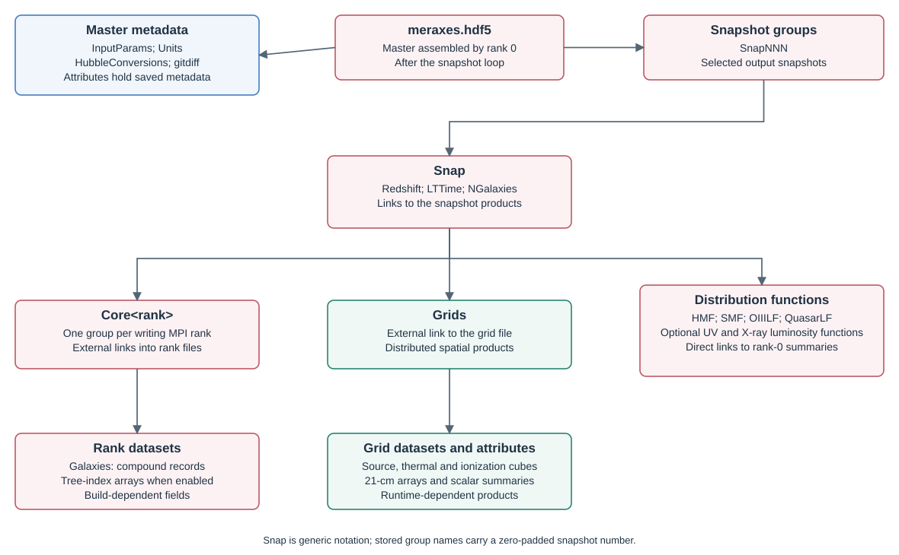

# Output files and data dictionary

This reference describes the output writers in Meraxes commit `90d8474cf41dcea646189fb86a65b7e18755ed95`. The schema depends on the executable's build options, runtime physics flags, selected output snapshots, and whether a calculation has completed. Inspect the file rather than assuming that every field or dataset in this reference is present. See [Getting started](getting-started.md) for running the model, [Inputs](inputs.md) for configuration and source data, [IGM physics](igm.md) for the grid calculation, and [Stochasticity](stochasticity.md) for the distinction between catalogue and treated source quantities.

## File layout and external links

Let `p = FileNameGalaxies`, `s` be the simulation snapshot number, and `r` the MPI rank. All files are written under `OutputDir`.

| File | Producer and contents |
| --- | --- |
| `<p>.hdf5` | Master file created by rank 0 at the end of an ordinary run. It contains run metadata, snapshot groups, and relative HDF5 external links to the other output files. |
| `<p>_<r>.hdf5` | Per-rank galaxy tables and merger-walk indices. Rank 0 also contains the globally reduced mass/luminosity functions. |
| `<p>_grids_<s>.hdf5` | Collectively written reionization, source, thermal, 21-cm, lightcone, power-spectrum, and optional LW diagnostics. The filename uses the unpadded integer snapshot number. |
| `<p>_metal_grids_<s>.hdf5` | Collectively written metal-enrichment grids in a `USE_MINI_HALOS` build with `Flag_IncludeMetalEvo`. |

Snapshot group names use `Snap%03d`, for example `Snap007`; `%03d` is a minimum width, not a limit on snapshot numbers. `Core0`, `Core1`, … identify MPI ranks. The master has one group for each requested output snapshot, not a record of every possible simulation snapshot. The IGM wrappers can also create intermediate grid files for unselected snapshots to hold global attributes; those files are not added as extra snapshot groups in the master. A `stars` grid belongs under `SnapNNN/Grids`, whereas the galaxy compound table belongs under `SnapNNN/CoreN/Galaxies`.



The master creates **external** links, even though one source comment calls them “soft links.” A `CoreN` group contains separate links to each available rank-file dataset. `Grids` and `MetalGrids` link to the root group of their grid files. Distribution functions such as `HMF` or `QuasarLF` are linked directly under `SnapNNN` from the rank-0 file; they are not inside `Core0` in the master. Keep the linked files together with the master when copying an output, because the external filenames are relative basenames. Copying the master alone does not copy the data.

### Metadata

| Location | Contents and interpretation |
| --- | --- |
| Root attributes | `NCores`, the number of MPI ranks. Per-rank files also have `iCore`. Numeric attributes are commonly stored as one-element arrays. |
| `InputParams` attributes | Effective run parameters with their registered integer, floating-point, or string types. `EndSnapshotLightcone` is also stored after the program determines it when a lightcone is enabled. |
| `Units` attributes | Exact unit strings for each registered galaxy output field. |
| `HubbleConversions` attributes | Per-field strings describing removal of the stored h dependence: `v/h`, `v*(h**2)`, `v`, or `None`, as applicable. |
| `Units/Grids`, `HubbleConversions/Grids` attributes | Registered grid units and h-conversion strings when patchy reionization is enabled. There are naming and coverage discrepancies listed below. |
| `Units/MetalGrids` attributes | Metal-grid unit registry in an enabled mini-halo/metal-evolution run. There is no corresponding `HubbleConversions/MetalGrids` registry. |
| `gitdiff` dataset and its `gitref` attribute | Compile-time source diff and revision when `MERAXES_GITREF_STR` is defined. |
| `SnapNNN` attributes | `NGalaxies` is the total linked galaxy-row count over ranks; `Redshift` is the simulation redshift; `LTTime` is the lookback time multiplied by the program's length/velocity unit and divided by seconds per Myr. Under the standard Mpc/h and km/s unit convention it retains Myr/h, so divide by h for physical Myr. In a summary-only output, `NGalaxies` can be zero despite nonzero distribution functions. |

The raw HDF5 reader does not apply these conversions. For a mass with stored units `1e10 solMass` and conversion `v/h`, the physical mass in solar masses is `v * 1e10 / h`. A comoving position with `Mpc` and `v/h` becomes `v/h` cMpc. A physical radius with the same metadata becomes `v/h` physical Mpc; the unit string alone does not distinguish these cases. `None` means that the registry requests no h transformation, not that every quantity is dimensionless.

### Output modes and completeness

`FlagMCMC` uses a different calculation/output workflow; the ordinary HDF5 catalogue writer described here is invoked outside that mode. `FlagInteractive == 2` skips the galaxy table and merger-walk arrays while retaining enabled distribution-function output. Requested output snapshots control the master links and full catalogue/grid outputs.

Full reionization output cubes require `Flag_PatchyReion`, `Flag_OutputGrids`, and the program's `check_if_reionization_ongoing(s)` gate. `Flag_OutputGridsPostReion` allows continued grid output through the otherwise completed phase; the lightcone also influences this gate. The spin-temperature wrapper separately writes its input/source grids at selected output snapshots without testing `Flag_OutputGrids`. Consequently, a file can contain source cubes but no full output cubes.

Global summaries are written to dataset attributes. When a cube is not available, the attribute writer can create a **zero-length float32 dataset of shape `(0,)`** to hold its attributes. Dataset presence is therefore insufficient evidence for a saved 3-D field. Check `ndim`, `shape`, and `size` before loading or plotting a cube. These placeholders are distinct from legitimately empty rank-local galaxy tables.

## Galaxy tables and merger indices

Each `SnapNNN/CoreN/Galaxies` is a one-dimensional HDF5 compound dataset of length equal to that rank's output galaxy count. The current normal-row selection is `Type < 3`; it includes eligible ghosts and does not impose a general positive-stellar-mass cut. A nearby source comment about excluding zero-mass galaxies is not the current selection rule.

The writer enables HDF5 table compression. Its chunk size depends on the number of rows; inspect `dataset.chunks` and `dataset.compression` instead of assuming a fixed block size. Compound fields are scalar except the vectors and histories identified below.

`H = N_HISTORY_SNAPS` and `B = MAGS_N_BANDS` are compile-time lengths. The current CMake defaults are 17 and 11, respectively, but a build can override them. Read the field subarray shape from `dataset.dtype`; neither a history length nor a photometric band order should be inferred from an old output. The `NewStars` histories are formed stellar masses per snapshot, not SFR samples. An early snapshot may contain zero-filled older entries.

¹ The writer uses native C/HDF5 types: `H5T_NATIVE_FLOAT`, `H5T_NATIVE_INT`, and `H5T_NATIVE_LLONG`. These correspond to float32, int32, and signed int64 on the supported common platforms; the file dtype is definitive. In particular, the on-disk `ID` is registered as signed `H5T_NATIVE_LLONG` despite its unsigned internal galaxy representation.

### Standard galaxy fields

| Field | HDF5 type | Meaning | Stored units | h conversion |
| --- | --- | --- | --- | --- |
| `HaloID` | int64¹ | Current host/subhalo identifier; −1 for a ghost. | `None` | `None` |
| `ID` | int64¹ | Galaxy identifier, distinct from any catalogue row index. | `None` | `None` |
| `Type` | int32¹ | Galaxy state: 0 central, 1 resolved satellite, 2 orphan; merged/dead state 3 is excluded from normal rows. | `None` | `None` |
| `CentralGal` | int32¹ | Rank-local output row of the central galaxy of the FOF group; −1 for a ghost. | `None` | `None` |
| `GhostFlag` | int32¹ | Nonzero when the galaxy is being carried through a temporarily absent/skipped halo. | `None` | `None` |
| `Len` | int32¹ | Current or retained subhalo particle count. | `None` | `None` |
| `MaxLen` | int32¹ | Largest subhalo particle count recorded along the galaxy history. | `None` | `None` |
| `Pos` | float32[3] | Three-component comoving position; an orphan retains its last resolved subhalo position. | `Mpc` | `v/h` |
| `Vel` | float32[3] | Three-component velocity copied from the galaxy/halo state. | `km/s` | `None` |
| `Spin` | float32¹ | Dimensionless halo spin parameter. | `None` | `None` |
| `Mvir` | float32¹ | Current or retained subhalo virial mass. | `1e10 solMass` | `v/h` |
| `Rvir` | float32¹ | Physical virial radius. | `Mpc` | `v/h` |
| `Vvir` | float32¹ | Virial velocity. | `km/s` | `None` |
| `Vmax` | float32¹ | Maximum circular velocity. | `km/s` | `None` |
| `FOFMvir` | float32¹ | Parent FOF-group virial mass; −1 for a ghost. | `1e10 solMass` | `v/h` |
| `HotGas` | float32¹ | Hot gas reservoir mass. | `1e10 solMass` | `v/h` |
| `MetalsHotGas` | float32¹ | Metal mass in the hot reservoir; not a metallicity ratio. | `1e10 solMass` | `v/h` |
| `ColdGas` | float32¹ | Cold gas reservoir mass. | `1e10 solMass` | `v/h` |
| `MetalsColdGas` | float32¹ | Metal mass in the cold reservoir. | `1e10 solMass` | `v/h` |
| `H2Frac` | float32¹ | Molecular fraction assigned to the cold gas. | `None` | `None` |
| `H2Mass` | float32¹ | Molecular component of the cold gas. | `1e10 solMass` | `v/h` |
| `HIMass` | float32¹ | Atomic component of the cold gas. | `1e10 solMass` | `v/h` |
| `Mcool` | float32¹ | Cooling mass accumulated in the current snapshot bookkeeping. | `1e10 solMass` | `v/h` |
| `DiskScaleLength` | float32¹ | Physical disk scale length, normally derived from spin and virial radius. | `Mpc` | `v/h` |
| `StellarMass` | float32¹ | Surviving stellar mass after recycling/mass loss. | `1e10 solMass` | `v/h` |
| `GrossStellarMass` | float32¹ | Cumulative mass formed into stars before recycling removes material. | `1e10 solMass` | `v/h` |
| `MetalsStellarMass` | float32¹ | Metal mass in stars. | `1e10 solMass` | `v/h` |
| `Sfr` | float32¹ | Star-formation-rate accumulator for the current snapshot, converted by the writer. | `solMass/yr` | `None` |
| `LOIII` | float32¹ | Intrinsic [O III] line luminosity used by the line-emission model. | `1e40 erg/s` | `None` |
| `ionization_param` | float32¹ | The line-emission model parameter q, with velocity units; not dimensionless U. | `cm/s` | `None` |
| `FescWeightedSfr` | float32¹ | Current-snapshot stellar SFR weighted by the untreated escape fraction. | `solMass/yr` | `None` |
| `EjectedGas` | float32¹ | Ejected gas reservoir available for reincorporation. | `1e10 solMass` | `v/h` |
| `MetalsEjectedGas` | float32¹ | Metal mass in the ejected reservoir. | `1e10 solMass` | `v/h` |
| `BlackHoleMass` | float32¹ | Physical black-hole mass reservoir. | `1e10 solMass` | `v/h` |
| `Rcool` | float32¹ | Latest cooling radius in the current snapshot bookkeeping. | `Mpc` | `v/h` |
| `Cos_Inc` | float32¹ | Cosine of the randomly assigned disk inclination used in attenuation. | `None` | `None` |
| `MergTime` | float32¹ | Remaining dynamical-friction merger clock for an orphan. | `Myr` | `v/h` |
| `MergerStartRadius` | float32¹ | Initial orbital separation divided by the central virial radius; metadata discrepancy below. | `Mpc` | `v/h` |
| `BaryonFracModifier` | float32¹ | Multiplicative modifier to baryon infall, including the enabled suppression prescriptions. | `None` | `None` |
| `FOFMvirModifier` | float32¹ | Multiplicative correction applied to the FOF mass. | `None` | `None` |
| `MvirCrit` | float32¹ | Local UV-background critical mass sampled for this galaxy. | `1e10 solMass` | `v/h` |
| `tau_cgm` | float32¹ | CGM optical-depth term used for escape-fraction suppression. | `None` | `None` |
| `MergerBurstMass` | float32¹ | Stellar mass formed cumulatively in merger-triggered bursts. | `1e10 solMass` | `v/h` |
| `MWMSA` | float32¹ | Mass-weighted mean stellar age; writer normalization caveat below. | `Myr` | `v/h` |
| `NewStars` | float32[H] | Rolling stellar-formation history; element 0 is the current snapshot and successive elements are older snapshots. | `1e10 solMass` | `v/h` |
| `Fesc` | float32¹ | Untreated stellar ionizing escape fraction most recently assigned; stochastic draws live in separate internal accumulators. | `None` | `None` |
| `FescWeightedGSM` | float32¹ | Cumulative untreated escape-weighted formed stellar mass, inherited through mergers. | `1e10 solMass` | `v/h` |
| `FescBH` | float32¹ | AGN ionizing escape fraction. | `None` | `None` |
| `BHemissivity` | float32¹ | Snapshot-local effective AGN ionizing source rate after escape, duty-cycle/response treatment; the legacy unit string is not a literal photon-count interpretation. | `1e60 photons` | `None` |
| `QuasarMag` | float32¹ | Intrinsic absolute AB magnitude at 1450 Å; 999.9 when the intrinsic UV luminosity is nonpositive. | `AB mag (M1450)` | `None` |
| `QuasarLX` | float32¹ | Intrinsic AGN hard-band (2–10 keV) luminosity. | `LX [1e10 L_sun, 2-10 keV, intrinsic]` | `None` |
| `NHbin` | int32¹ | Drawn obscuring hydrogen-column bin; −1 for no AGN. | `0-4 = drawn logNH bin (20-21/21-22/22-23/23-24/24-26 CTK); -1 = no AGN` | `None` |
| `BHXrayEmissivity` | float32¹ | Observed/obscured hard-band AGN luminosity; written from the internal hard-band quantity. | `LX [1e10 L_sun, 2-10 keV, observed/obscured]` | `None` |
| `DutyCycleAGN` | float32¹ | AGN active fraction, clamped to [0, 1]. | `None` | `None` |
| `EffectiveBHM` | float32¹ | Cumulative AGN ionizing budget expressed as an equivalent stellar-source mass; distinct from BlackHoleMass. | `1e10 solMass` | `v/h` |
| `BlackHoleAccretedHotMass` | float32¹ | Hot-mode accreted black-hole mass in the current snapshot bookkeeping. | `1e10 solMass` | `v/h` |
| `BlackHoleAccretedColdMass` | float32¹ | Cold-mode accreted black-hole mass in the current snapshot bookkeeping. | `1e10 solMass` | `v/h` |
| `dt` | float32¹ | Per-step evolution timestep, converted by the writer. | `Myr` | `v/h` |

The `Metals*` fields are masses. Divide by the corresponding gas or stellar mass to obtain a metallicity ratio, with an explicit treatment of zero-mass reservoirs. `GrossStellarMass`, `StellarMass`, `NewStars`, and `FescWeightedGSM` answer different questions: formed mass, surviving mass, recent formation history, and the cumulative escaped-ionizing source budget. The deterministic `Fesc`, `FescWeightedSfr`, and `FescWeightedGSM` catalogue fields are not replacements for stochastic source accumulators. Escape-fraction scatter or the `Flag_RemoveSFRScatter` treatment selects treated cumulative/rate source accumulators, with optional `Flag_SourceRecalibration` factors; a grid source then need not equal a simple sum of the saved untreated catalogue fields. See [Stochasticity](stochasticity.md).

### Mini-halo fields

These fields are compiled into the galaxy output with `USE_MINI_HALOS`; their scientific activity depends on the relevant population, cooling, and enrichment configuration. The names in the first column are the exact on-disk names, which sometimes differ from C members.

| Field | HDF5 type | Meaning | Stored units | h conversion |
| --- | --- | --- | --- | --- |
| `Galaxy_Population` | int32¹ | Population state used by mini-halo physics: 2 for Pop II, 3 for Pop III. | `None` | `None` |
| `Flag_ExtMetEnr` | int32¹ | External metal-enrichment flag. | `None` | `None` |
| `Pop2StellarMass` | float32¹ | Surviving Pop II stellar mass; internal member StellarMass_II. | `1e10 solMass` | `v/h` |
| `Pop3StellarMass` | float32¹ | Surviving Pop III stellar mass; internal member StellarMass_III. | `1e10 solMass` | `v/h` |
| `RemnantMass` | float32¹ | Stellar remnant mass; internal member Remnant_Mass. | `1e10 solMass` | `v/h` |
| `GrossStellarMassIII` | float32¹ | Cumulative formed Pop III stellar mass. | `1e10 solMass` | `v/h` |
| `FescIIIWeightedSfr` | float32¹ | Current-snapshot Pop III SFR weighted by the untreated Pop III escape fraction. | `solMass/yr` | `None` |
| `RmetalBubble` | float32¹ | Physical radius of the galaxy metal-enrichment bubble. | `Mpc` | `v/h` |
| `MetalProbability` | float32¹ | Grid-derived enrichment probability at the galaxy; internal member Metal_Probability. | `None` | `None` |
| `GalMetalProbability` | float32¹ | Uniform [0, 1) variate stored per galaxy for comparison with its grid enrichment probability; internal member GalMetal_Probability. | `None` | `None` |
| `MvirCrit_MC` | float32¹ | Local molecular-cooling critical halo mass. | `1e10 solMass` | `v/h` |
| `NewStarsPop2` | float32[H] | Rolling Pop II formation history; internal member NewStars_II. | `1e10 solMass` | `v/h` |
| `NewStarsPop3` | float32[H] | Rolling Pop III formation history; internal member NewStars_III. | `1e10 solMass` | `v/h` |
| `FescIII` | float32¹ | Untreated Pop III ionizing escape fraction. | `None` | `None` |
| `FescIIIWeightedGSM` | float32¹ | Cumulative untreated escape-weighted formed Pop III mass. | `1e10 solMass` | `v/h` |

### Photometry fields

`CALC_MAGS` adds the following fields. `MagsIII` additionally requires `USE_MINI_HALOS`. Magnitude calculations are associated with configured target snapshots and bands; inspect the photometry configuration before interpreting a band or a field at another snapshot.

| Field | HDF5 type | Meaning | Stored units | h conversion |
| --- | --- | --- | --- | --- |
| `LOIII_dusty` | float32¹ | Dust-attenuated [O III] luminosity when a suitable rest-band attenuation is available; otherwise initially copied from LOIII. | `1e40 erg/s` | `None` |
| `Mags` | float32[B] | Intrinsic magnitudes in the configured band order. | `mag` | `None` |
| `DustyMags` | float32[B] | Dust-attenuated magnitudes in the same band order. | `mag` | `None` |
| `MagsIII` | float32[B] | Pop III magnitudes in the configured band order. | `mag` | `None` |

### Galaxy metadata caveats

The current writer preserves several historical metadata conventions that must be distinguished from the calculation:

| Field | Source-level interpretation and consequence |
| --- | --- |
| `MergerStartRadius` | `mergers.c` assigns `sat_rad / mother->Rvir`; the writer copies that dimensionless ratio unchanged, but registers `Mpc` and `v/h`. Do not interpret the saved ratio as a length or divide it by h solely because of this registry. |
| `MWMSA` | `current_mwmsa()` returns a difference of internal `LTTime` values without the `UnitTime_in_Megayears` multiplication applied to `dt` and `MergTime`. Although metadata says `Myr` and `v/h`, a physical-age analysis must account for this writer inconsistency and the run's time unit. |
| `BHemissivity` | The registry says `1e60 photons`, but the current AGN routine rescales the emission by the equivalent-mass factor and accretion time, and applies duty-cycle or response treatment before accumulating it. Treat it as the effective source quantity used by the model; do not multiply the saved value by `1e60` and call it a total photon count. `EffectiveBHM` records the cumulative equivalent-source mass, while the grid `effective_bhar` is the rate channel. |
| `ionization_param` | The saved parameter has units `cm/s`. It is the model's q-like line-emission parameter; a dimensionless ionization parameter requires a separately justified conversion and interpretation of the current line-emission prescription. |
| `NHbin` | The “units” attribute is an explanatory label: `0-4 = drawn logNH bin (20-21/21-22/22-23/23-24/24-26 CTK); -1 = no AGN`. The numbers are bin indices, not column densities. |

### Merger-walk datasets

All indices are rank-local row positions, not galaxy IDs. A negative value (`−1`) marks a missing connection. Keep the rank identity when following these arrays; concatenating galaxy tables without adjusting indices changes their meaning.

| Dataset under `CoreN` | Shape/type | Meaning |
| --- | --- | --- |
| `FirstProgenitorIndices` | `(N_current,)`, native int, normally int32 | Row in the immediately preceding snapshot's table of the first progenitor of each current galaxy. |
| `DescendantIndices` | `(N_previous,)`, native int | Row in the next snapshot's table of each previous galaxy's descendant. |
| `NextProgenitorIndices` | `(N_previous,)`, native int | Next previous-snapshot row in the linked progenitor list of a shared descendant. |

The writer builds these links only when the **immediately preceding simulation snapshot** is also a selected output snapshot. It writes `FirstProgenitorIndices` on the current snapshot and adds `DescendantIndices` and `NextProgenitorIndices` retrospectively to the previous snapshot. Sparse output selection therefore does not produce a walk across arbitrary gaps. The final selected snapshot normally has no descendant/next-progenitor arrays added by a future output. Availability is also affected by the summary-only mode. Positive-length walk arrays are chunked and deflate-compressed; the zero-length path uses a simple empty dataset.

## Reionization and radiation grids

Unless a shape below states otherwise, a full field is a float32 cube `(D, D, D)`, where `D = ReionGridDim`. Disk cubes are logically unpadded even when FFTW uses padded internal storage. MPI ranks write x slabs into the same dataset. Cubes have chunks `(1, D, D)` and no compression; one full cube requires `4 D³` data bytes before HDF5 overhead. The final axis varies fastest in the C indexing; an x slice aligns with one complete disk chunk.

The write conditions below apply within the overall output gates described above. `BH` means `physics.Flag_BHFeedback`, `Rec` means `Flag_IncludeRecombinations`, `UVB` means `ReionUVBFlag`, `Spin` means `Flag_IncludeSpinTemp`, `Bright` means `Flag_Compute21cmBrightTemp`, `LC` means `Flag_ConstructLightcone`, and `PS` means `Flag_ComputePS`. A calculation flag is not proof that a cube was written. Conditions govern the writer; scientific dependencies between calculations are described in [IGM physics](igm.md).

### Source and ordinary output fields

“Input” in this table means an input to the IGM calculation. These datasets are generated output products of Meraxes, not all externally supplied files. In particular, `stars` is constructed from galaxy sources, whereas `deltax` is read from the external density field.

The separate stochastic `xray_luminosity` source field and the AGN hard/soft X-ray source fields and their histories are internal arrays, not saved full source cubes. In particular, `sfr` does not encode stochastic X-ray luminosity draws. The saved source cubes therefore do not by themselves reconstruct every local heating channel; the root-level `XrayEmissivity_HMXB` history described below records a thermal-calculation box mean.

| Dataset | Role and scientific meaning | Additional write condition | Stored units; h conversion |
| --- | --- | --- | --- |
| `deltax` | Input density contrast δ, with local density proportional to `1 + δ`. | Source/input-grid writer. | `None`; `None`. |
| `stars` | Input cell sum of the cumulative escaped stellar ionizing source, expressed as formed stellar mass. The ordinary source is `FescWeightedGSM`; escape-fraction scatter or `Flag_RemoveSFRScatter` selects `StochasticityTreatedFescWeightedGSM`, with optional source-recalibration factors. It is neither surviving `StellarMass` nor a stellar mass density. | Source/input-grid writer. | `1e10 solMass`; `v/h`. |
| `weighted_sfr` | Input cell sum of the escape-weighted stellar SFR source. | Source/input-grid writer. | `solMass/yr`; `None`. |
| `effective_bhm` | Input cumulative AGN ionizing budget in equivalent stellar-source mass, deposited only for galaxies above `BlackHoleMassLimitReion`. | Source/input-grid writer + BH. | Not registered. Writer copies the internal mass channel; it follows the equivalent-source mass normalization, not a physical black-hole-mass grid. |
| `effective_bhar` | Input effective AGN ionizing rate in equivalent stellar-source SFR, with the same black-hole-mass selection. | Source/input-grid writer + BH. | `solMass/yr`; `None`. |
| `sfr` | Input unweighted stellar source rate for thermal/heating histories; its source can be snapshot SFR or a cumulative-mass/timescale estimate according to the configured source prescription. | Source/input-grid writer + Spin. | Not registered; the writer explicitly converts to `solMass/yr`, with no further h removal. |
| `xH` | Output neutral hydrogen fraction, including the excursion-set UV ionization treatment. | Full output-grid writer. | `None`; `None`. |
| `r_bubble` | Output ionized-bubble/filter-radius diagnostic. Its values are populated by the enabled ionization/recombination treatment; writing the field alone does not guarantee nonzero radii. | Full output-grid writer. | `Mpc`; `v/h`. |
| `temp_kinetic_all_gas` | Output temperature diagnostic combining the kinetic thermal state with the ionized/partially ionized gas treatment. | Full output-grid writer. | `K`; `None`. |
| `z_at_ionization` | Persistent redshift of first full ionization of the cell. | Rec. | `None`; `None`. |
| `residual_xH` | Residual neutral fraction diagnostic from the recombination prescription, in its stored scaled normalization. | Rec. | Exact registry string `1e4`; `None`. |
| `clumping_factor` | Effective ionized-gas clumping factor from the recombination prescription. | Rec. | `None`; `None`. |
| `Gamma12` | Hydrogen photoionization-rate diagnostic in the recombination/UV treatment. | Rec. | `1e-12 /s`; `v*(h**2)`. |
| `t_resp` | Ionization response timescale used by the feedback/source-response treatment. | Rec. | `Myr`; `None`. |
| `N_rec` | Cumulative recombinations per baryon; copied from its padded internal grid into a disk cube. | Rec. | `None`; `None`. |
| `J_21_at_ionization` | UV-background intensity stored at ionization, with subsequent updates depending on the UVB mode. | UVB. | Exact registry string `10e-21 erg/s/Hz/cm/cm/sr`; `v*(h**2)`. |
| `Mvir_crit` | Local critical halo mass for UV-background suppression. This feedback field is evaluated for galaxy evolution from the persistent ionization/intensity state, so its timing differs from a newly computed same-snapshot ionization field. | UVB. | `1e10 solMass`; `v/h`. |
| `TS_box` | Hydrogen spin temperature. | Spin. | Physical `K`, no h conversion; registry key is **`Ts_box`**, not the written name. |
| `Tk_box` | Kinetic gas temperature evolved by the thermal solver. | Spin. | `K`; `None`. |
| `x_e_box` | Electron fraction evolved by the partial-ionization/thermal solver; written from `x_e_box_prev`. It is not generally `1 − xH`. | Spin. | `None`; `None`. |
| `delta_T` | Coeval 21-cm differential brightness temperature, with configured spin-temperature and peculiar-velocity treatment. | Bright. | `mK`; `None`. |
| `LightconeBox` | Adjacent coeval brightness fields interpolated along the lightcone; shape `(D, D, L)`, `L = LightconeLength`, chunks `(1, D, L)`. | LC and `s == EndSnapshotLightcone`, with `s != 0`. | `mK`; `None`. |
| `lightcone-z` | Redshift of each line-of-sight slice; shape `(L,)`, float32, contiguous. | Same lightcone condition. | Not registered; dimensionless redshift. |
| `k_bins` | Mean wavenumber in each power-spectrum bin; shape `(P,)`, `P = PS_Length`, float32, contiguous. | PS. | Not registered; physical comoving `Mpc⁻¹` from `BoxSize/h`. |
| `PS_data` | Dimensional 21-cm power `Δ²₂₁ = k³ P₂₁/(2π²)`; shape `(P,)`, float32, contiguous. | PS. | `mK2`; `None`. |
| `PS_error` | `PS_data / sqrt(N_modes)` for the Fourier-mode count used by the program, not an instrumental-noise estimate; shape `(P,)`, float32, contiguous. | PS. | `mK2`; `None`. |

The writer's literal `residual_xH` and `J_21_at_ionization` unit strings are retained here. The residual-neutral integrand explicitly includes a factor of `1e4`; multiply the stored residual diagnostic by `1e-4` to remove that scale, without equating its subgrid average to the excursion-set `xH` field. For `J_21_at_ionization`, the UVB prefactor uses a numerical factor `1e21`, while the registry literally says `10e-21`. These are discrepant historical normalization labels: retain the raw metadata and use the actual UVB formula for a physically normalized intensity, rather than introducing a factor of ten from the string alone. Grid scalar summaries retain the calculation's stored normalization as well; the writer does not apply a reader-side h conversion to the attributes.

### Mini-halo and LW fields

The following names additionally require a `USE_MINI_HALOS` build. The `II` suffix denotes a thermal/radiation channel omitting Pop III sources; it does not mean that a separate Pop-II-only UV ionization field has been saved, and this channel can still contain AGN contributions.

| Dataset | Meaning | Additional write condition | Stored units; h conversion |
| --- | --- | --- | --- |
| `starsIII` | Pop III cumulative escaped stellar source mass summed in a cell. | Source/input-grid writer. | Physical normalization `1e10 solMass`, `v/h`; registry is only created when `Flag_IncludeLymanWerner` is enabled. |
| `weighted_sfrIII` | Pop III escaped SFR source summed in a cell. | Source/input-grid writer. | `solMass/yr`, no further h removal; registry has the same LW guard. |
| `sfrIII` | Unweighted Pop III thermal/heating source-rate grid. | Source/input-grid writer + Spin. | Not registered; explicitly converted to `solMass/yr` by the writer. |
| `Mvir_crit_MC` | Molecular-cooling critical halo mass in the LW feedback treatment. | UVB + `Flag_IncludeLymanWerner`. | `1e10 solMass`; `v/h`. |
| `JLW_box` | Total LW-band specific intensity from the enabled stellar and AGN channels. | `Flag_IncludeLymanWerner`. | `1e-21 erg/s/Hz/cm/cm/sr`; `v` (identity). |
| `JLW_boxII` | LW intensity omitting Pop III sources, retaining the ordinary stellar and AGN channels. | `Flag_IncludeLymanWerner`. | Same as `JLW_box`, but metadata is registered under **`JLW_box_II`**. |
| `TS_boxII` | Spin temperature for the channel omitting Pop III thermal/radiation sources. | Spin. | Physical `K`, no h removal; registry key is **`Ts_boxII`**. |
| `Tk_boxII` | Kinetic temperature for that channel. | Spin. | `K`; `None`. |
| `delta_TII` | Coeval brightness for that thermal channel, using the model's ionization field. | Bright. | `mK`; `None`. |
| `PSII_data` | Dimensional power of `delta_TII`; shape `(P,)`, float32, contiguous. | PS. | `mK2`; `None`. |
| `PSII_error` | Corresponding mode-count error estimate; shape `(P,)`, float32, contiguous. | PS. | `mK2`; `None`. |

The current writer does not produce a `LightconeBoxII` dataset.

In a mini-halo build with **both** `Flag_IncludeSpinTemp` and `Flag_IncludeLymanWerner`, the full output writer also saves the following contiguous float64 diagnostics. Let `F = TsNumFilterSteps` and `Q = LW_NLEV = NSPEC_MAX + 1` (currently `NSPEC_MAX = 23`). All ranks hold the same diagnostics; rank 0 writes the values while other ranks select no elements. These are filter-shell/spectral diagnostics, not spatial cubes. The writer supplies no unit or h-conversion attributes for them; their spectral and emissivity factors must be interpreted together in the LW calculation's normalization.

| Dataset | Shape | Meaning |
| --- | --- | --- |
| `LW_shape_stellar` | `(F,)` | Summed ordinary-stellar LW spectral/survival shape for each filter shell. |
| `LW_shape_III` | `(F,)` | Corresponding Pop III shape. |
| `LW_shape_AGN` | `(F,)` | Corresponding AGN shape. |
| `LW_zpp` | `(F,)` | Source-emission redshift associated with each shell. |
| `LW_emissivity_stellar` | `(F,)` | Shell-dependent box-mean ordinary-stellar source emissivity factor. |
| `LW_emissivity_III` | `(F,)` | Corresponding Pop III factor. |
| `LW_emissivity_AGN` | `(F,)` | Corresponding AGN factor, including the configured AGN LW efficiency. |
| `LW_spectral_stellar` | `(F, Q)` | Ordinary-stellar per-Lyman-level contributions to the shell's spectral sum. |
| `LW_spectral_III` | `(F, Q)` | Pop III per-level contributions. |
| `LW_spectral_AGN` | `(F, Q)` | AGN per-level contributions. |

The spectral arrays are indexed by the Lyman level in the second dimension; the calculation uses levels beginning at `n = 2`. Do not treat the first two array slots as additional measured transitions or assume every slot is populated.

### Global grid attributes

The following are exact attribute names and their owning datasets. They are written as one-element double-precision values, even when the parent cube is float32. For a field `q`, volume weighting is a cell average and mass weighting uses the local density weighting. These are global reductions over the box, not attributes of an individual x slab.

| Dataset | Attribute names | Meaning / condition |
| --- | --- | --- |
| `xH` | `volume_weighted_global_xH`, `mass_weighted_global_xH` | Global neutral fractions with the respective weighting. |
| `xH` | `mass_weighted_global_tau_e`, `mass_weighted_global_tau_e_sim` | Thomson optical-depth diagnostics from the mass-weighted ionization history. `_sim` is the contribution accumulated through the current snapshot; the total adds the fixed fully ionized integral from z = 0 to the last requested output's redshift, with doubly ionized helium at z ≤ 4 and singly ionized helium above it. See [IGM physics](igm.md) for the integration convention. |
| `r_bubble` | `volume_weighted_global_r_bubble`, `mass_weighted_global_r_bubble` | Mean bubble/filter radii in stored length normalization. |
| `temp_kinetic_all_gas` | `volume_weighted_global_temp_kinetic_all_gas`, `mass_weighted_global_temp_kinetic_all_gas` | Mean all-gas kinetic-temperature diagnostic, K. |
| `Gamma12` | `volume_weighted_global_Gamma12`, `mass_weighted_global_Gamma12` | Mean photoionization-rate diagnostic in stored normalization; Rec. |
| `N_rec` | `volume_weighted_global_N_rec`, `mass_weighted_global_N_rec` | Mean cumulative recombinations per baryon; Rec. |
| `residual_xH` | `volume_weighted_global_residual_xH`, `mass_weighted_global_residual_xH` | Mean scaled residual-neutral diagnostic; Rec. |
| `clumping_factor` | `volume_weighted_global_clumping_factor`, `mass_weighted_global_clumping_factor` | Mean clumping factor; Rec. |
| `weighted_sfr` | `volume_weighted_global_weighted_sfr` | Mean escaped stellar SFR **per cell**, `solMass/yr`; not a rate density without division by cell volume. |
| `effective_bhar` | `volume_weighted_global_effective_bhar` | Mean equivalent AGN source rate per cell, `solMass/yr`; BH. |
| `weighted_sfrIII` | `volume_weighted_global_weighted_sfrIII` | Mean escaped Pop III SFR per cell, `solMass/yr`; mini-halo build. |

Thermal and brightness summaries use `volume_ave_*` names. Their attachment to `TS_box` is a storage convention; it does not imply that an X-ray derivative or a Lyα intensity is a spin temperature.

| Dataset | Exact attribute | Meaning / units | Condition |
| --- | --- | --- | --- |
| `TS_box` | `volume_ave_TS` | Mean spin temperature, K. | Spin. |
| `Tk_box` | `volume_ave_TK` | Mean kinetic temperature, K. | Spin. |
| `x_e_box` | `volume_ave_xe` | Mean thermal/partial-ionization electron fraction. It is not generally the complement of a mean `xH`. | Spin. |
| `TS_box` | `volume_ave_J_alpha` | Mean Lyα photon-number specific intensity from stellar and X-ray excitation channels; the coupling routine explicitly uses a number intensity rather than an energy intensity. | Spin. |
| `TS_box` | `volume_ave_xalpha` | Mean effective Wouthuysen–Field coupling coefficient, including the spectral correction. | Spin. |
| `TS_box` | `volume_ave_Xheat` | Mean X-ray contribution to `dT_K/dz`, K per unit redshift, including the enabled stellar and AGN channels. It excludes the adiabatic, Compton, and changing-species terms of the full thermal derivative. | Spin. |
| `TS_box` | `volume_ave_Xion` | Mean **source-only** X-ray contribution to `dx_e/dz`, per unit redshift; it excludes recombination from the full electron-fraction derivative. | Spin. |
| `TS_box` | `volume_ave_Xheat_AGN_soft` | Mean soft-AGN component of the X-ray `dT_K/dz` contribution. | Spin. |
| `TS_box` | `volume_ave_Xheat_AGN_hard` | Mean hard-AGN component of the X-ray `dT_K/dz` contribution. | Spin. |
| `delta_T` | `volume_ave_Tb` | Mean coeval differential brightness temperature, mK. | Bright. |
| `TS_boxII` | `volume_ave_TSII` | Mean spin temperature for the channel omitting Pop III sources, K. | Mini + Spin. |
| `Tk_boxII` | `volume_ave_TKII` | Mean kinetic temperature for that channel, K. | Mini + Spin. |
| `TS_boxII` | `volume_ave_J_alphaII` | Mean Lyα number intensity for that channel. | Mini + Spin. |
| `TS_boxII` | `volume_ave_XheatII` | Mean X-ray `dT_K/dz` contribution for that channel. | Mini + Spin. |
| `TS_boxII` | `volume_ave_XionII` | Mean source-only X-ray `dx_e/dz` contribution for that channel. | Mini + Spin. |
| `JLW_box` | `volume_ave_JLW` | Mean total LW intensity in the field's stored normalization. | Mini + LW. |
| `JLW_boxII` | `volume_ave_JLW_II` | Mean LW intensity omitting Pop III sources. | Mini + LW. |
| `JLW_box` | `volume_ave_JLW_AGN` | Mean AGN contribution to the LW intensity. | Mini + LW. |
| `delta_TII` | `volume_ave_TbII` | Mean coeval brightness for the channel omitting Pop III thermal/radiation sources, mK. | Mini + Bright. |

The X-ray summaries include `dt/dz`. Since cosmic time increases as redshift decreases, positive heating or ionization can correspond to a negative redshift derivative. They are not cumulative deposited energies, luminosities, ionization fractions, or total thermal derivatives. The writer does not separately register attribute units; the meanings above follow the derivative and averaging code.

### Grid registry discrepancies

| Issue | How to read the output |
| --- | --- |
| Written `TS_box` / `TS_boxII` versus registry `Ts_box` / `Ts_boxII` | Dataset names are case-sensitive. Retrieve the actual datasets by the written names; apply their physically established K normalization explicitly when the matching metadata key is absent. |
| Written `JLW_boxII` versus registry `JLW_box_II` | The unit and h-conversion registry uses a different spelling. The stored field follows the LW intensity normalization of `JLW_box`. |
| Unregistered `effective_bhm`, `sfr`, `sfrIII`, `lightcone-z`, `k_bins`, and `LW_*` diagnostics | Absence of an entry is not evidence of dimensionlessness. Consult the writer conversions and calculation as listed above. |
| `starsIII` and `weighted_sfrIII` registry only created under the LW flag | The source writer can save these fields without that metadata guard. |
| Attribute-only `(0,)` datasets | Read their summaries from `.attrs`; do not reshape them to an assumed cube. |

## Metal-enrichment grids

In a `USE_MINI_HALOS` build with `Flag_IncludeMetalEvo`, `SnapNNN/MetalGrids` links to the separate metal-grid file when it exists. Full fields are float32 cubes `(Dm, Dm, Dm)`, `Dm = MetalGridDim`, with chunks `(1, Dm, Dm)` and no compression. Their file is created/truncated by the metal-grid writer at a selected output snapshot.

| Exact dataset name | Meaning | Disk normalization |
| --- | --- | --- |
| `Probability_metals` | Cell metal-pollution probability/filling-factor diagnostic constructed from enriching bubbles, clamped to [0, 1]. | Dimensionless (`none` in the registry). |
| `Average Radius` | Average comoving metal-bubble radius for bubbles contributing to the cell's source bookkeeping. | Raw cMpc/h radius; copied without an h-removal conversion. Registry key is `R_ave`, with `cMpc`. |
| `Max Radius` | Intended maximum comoving source-bubble radius; the current MPI reduction caveat is described below. | Raw cMpc/h radius; registry key is `R_max`, with `cMpc`. |
| `mass_IGM` | Density-derived cell baryon mass plus the nonnegative `mass_gas` correction used by the enrichment calculation. | Writer multiplies by `UnitMass_in_g / SOLAR_MASS`; registry says `solMass`, with retained h convention as discussed below. |
| `N_bubbles` | Number of positive-radius source bubbles assigned to the cell. | Rounded and stored as float32, despite its count meaning (`none` in the registry). |
| `mass_metals` | Ejected metal mass from galaxies whose bubbles meet the IGM-pollution criterion. | Same writer mass conversion and registry convention. |
| `mass_gas` | Cell sum of eligible ejected gas minus hot and cold gas retained by galaxies, then clamped nonnegative. This is a correction used by the enrichment calculation, not a standalone gas-reservoir mass. | Same writer mass conversion and registry convention. |

The enrichment criterion in the deposition routine requires `RmetalBubble >= 3 Rvir` for IGM-polluting bubble volume and ejected metals. The radius and positive-bubble-count bookkeeping has its own conditions. In the current `R_max` deposition path, per-rank maxima enter an `MPI_SUM` reduction; when multiple ranks contribute to the same cell, the saved `Max Radius` need not equal the largest individual bubble radius. It should not be used as an exact global maximum without accounting for that implementation.

The radius datasets contain spaces in their exact HDF5 names. The registry also contains `Zigm_box` with unit `Zsol`, but the current metal writer does **not** save a dataset named `Zigm_box`. There are no metal-grid scalar summary attributes in this writer and no metal-specific h-conversion group. The shipped simulation unit files identify the mass unit as `1e10 Msun/h`; multiplying by `UnitMass_in_g / SOLAR_MASS` removes the `1e10` scale but does not explicitly remove h. Thus those metal mass values retain the mass unit's h dependence despite the `solMass` registry label; for that standard unit convention, divide by the run's h to obtain solar masses. Likewise, the raw comoving bubble radii require division by h to obtain cMpc. Check the run's saved unit parameters before applying a conversion.

## Mass and luminosity functions

Enabled distributions are computed from the galaxies passing the normal output selection, reduced over MPI ranks, and written into the rank-0 snapshot group. The master exposes each directly as `SnapNNN/<name>` through an external link. These summaries can be available in `FlagInteractive == 2` when the individual galaxy tables are omitted.

Every distribution is a contiguous float64 array `(n_bins, 3)` with columns **bin center, number density, uncertainty**. Dataset attributes are `n_bins`, `x_min`, `x_max`, `bin_width`, `volume`, `description`, `units`, and `columns`; the exact `columns` string is `center,density,uncertainty`.

For a configured range and a positive integer bin density $b$ (bins per dex or magnitude), `df_init` uses C integer truncation of the positive range product, then recomputes the actual width. The implemented bin count, width, and centers are

```{math}
:label: out-df-bins
\begin{aligned}
N_{\rm bin}&=\left\lfloor (x_{\max}-x_{\min})b\right\rfloor,\\
\Delta x&=\frac{x_{\max}-x_{\min}}{N_{\rm bin}},\\
x_i&=x_{\min}+\left(i+\frac12\right)\Delta x,
\qquad i=0,\ldots,N_{\rm bin}-1.
\end{aligned}
```

Let $w_g$ be the contribution of a selected galaxy: one for ordinary counts, or the activity/visibility weight specified in the table below. Counts are summed across MPI ranks before rank 0 writes the density. With $L_{\rm box}$ equal to the stored `BoxSize`, the normalization is

```{math}
:label: out-df-density
\begin{aligned}
C_i&=\sum_r\sum_{g\in\mathcal G_{r,i}}w_g,\\
V&=\left(\frac{L_{\rm box}}{h}\right)^3,\\
\phi_i&=\frac{C_i}{V\,\Delta x}.
\end{aligned}
```

Here $\mathcal G_{r,i}$ contains the galaxies on rank $r$ passing that distribution's selection and assigned to bin $i$. $V$ is the comoving volume in Mpc³; the coordinate $x$ determines whether the density is per dex or per magnitude.

| Dataset | Output flag/build | Abscissa and selection | Density units |
| --- | --- | --- | --- |
| `HMF` | `Flag_OutputHMF` | `log10(Mvir * 1e10/h)` in solar masses; ghosts excluded. This writer counts galaxy-host/subhalo masses, not an independent complete N-body FOF halo catalogue. | `per Mpc^3 per dex` |
| `SMF` | `Flag_OutputSMF` | `log10(StellarMass * 1e10/h)`; ghosts excluded and stellar mass must be positive. | `per Mpc^3 per dex` |
| `UVLF` | `CALC_MAGS`, `Flag_OutputUVLF`, target photometry snapshot | Finite `Mags[0]`; ghosts excluded. The first configured band determines the luminosity function. | `per Mpc^3 per mag` |
| `DustyLF` | `CALC_MAGS`, `Flag_OutputDustyLF`, target photometry snapshot | Finite `DustyMags[0]`; ghosts excluded. | `per Mpc^3 per mag` |
| `OIIILF` | `Flag_OutputOIIILF` | `log10(LOIII) + 40` in erg/s; finite positive luminosity, ghosts excluded. | `per Mpc^3 per dex` |
| `OIIIDustyLF` | `CALC_MAGS`, `Flag_OutputOIIILF`, target photometry snapshot, available rest-band attenuation index | `log10(LOIII_dusty) + 40`; finite positive luminosity, ghosts excluded. | `per Mpc^3 per dex` |
| `QuasarLF` | `Flag_OutputQuasarLF` | Finite `QuasarMag < 900`; ghosts excluded. Counts are weighted by `DutyCycleAGN * quasar_fobs`, where the latter is the configured opening-angle visibility fraction. | `per Mpc^3 per mag` |
| `XrayLF` | `Flag_OutputXrayLF` | Intrinsic 2–10 keV `log10(QuasarLX * 1e10 * L_sun)` in erg/s; positive luminosity, weight `DutyCycleAGN`. This branch does not separately exclude ghosts. | `per Mpc^3 per dex` |
| `XrayLF_obs` | `Flag_OutputXrayLF` | Observed/obscured 2–10 keV luminosity from `BHXrayEmissivity`, with the same duty-cycle weighting and ghost behavior. | `per Mpc^3 per dex` |

The mass bins are configured with `HMF_MinMass`, `HMF_MaxMass`, `HMF_BinsPerDex` and the analogous `SMF_*` parameters. UV, dusty-UV, and quasar bins use `UVLF_MinMag`, `UVLF_MaxMag`, `UVLF_BinsPerMag`. [O III] bins use `OIIILF_MinLogL`, `OIIILF_MaxLogL`, `OIIILF_BinsPerDex`; X-ray bins use `XrayLF_MinLogL`, `XrayLF_MaxLogL`, `XrayLF_BinsPerDex`. Read the saved bin centers and attributes for an actual output rather than rebuilding bins from rounded text.

For activity-weighted distributions, the code also accumulates the Bernoulli variance of each selection probability $p_g$. Ordinary unit counts leave that variance zero. After the MPI reduction, `df_write_hdf5` chooses a single uncertainty branch for the **whole distribution** according to whether its summed Bernoulli variance is positive:

```{math}
:label: out-df-uncertainty
\begin{aligned}
B_i&=\sum_r\sum_{g\in\mathcal G_{r,i}}p_g(1-p_g),\\
B_{\rm tot}&=\sum_i B_i,\\
\sigma_i&=
\begin{cases}
\dfrac{\sqrt{B_i}}{V\,\Delta x}, & B_{\rm tot}>0,\\[4pt]
\dfrac{\sqrt{C_i}}{V\,\Delta x}, & B_{\rm tot}\leq0\ \text{and}\ C_i>0,\\[4pt]
0, & B_{\rm tot}\leq0\ \text{and}\ C_i\leq0.
\end{cases}
\end{aligned}
```

For the weighted channels, $p_g$ is the duty-cycle or duty-cycle-times-visibility weight already used in $C_i$; for ordinary counts it can be represented as $p_g = 1$. A bin with zero variance receives zero Bernoulli uncertainty even if another bin triggered that branch. The uncertainty column is the implemented count-statistics estimate, not a sample-covariance, cosmic-variance, or instrument model.

### Root-level X-ray diagnostics

With `Flag_OutputXrayLF`, the master also attempts to write the following datasets directly at the root. They are float64, contiguous, and have no dedicated unit/column metadata from this writer. The emissivity-history buffers are allocated only with `Flag_IncludeSpinTemp`; that flag is required for valid allocated thermal-history products, even though the root writer is guarded by the X-ray-LF flag alone.

| Dataset | Shape | Meaning |
| --- | --- | --- |
| `NHTrans` | `(5,)` | Hard-X-ray transmission factors for the five obscuring column-density bins used by the model. |
| `NHfrac` | `(n_lx_bins, 5)` | Expected fractions in the same NH bins at the configured X-ray luminosity bin centers. The writer evaluates the obscuration model at `z = 2`, where its high-redshift dependence plateaus; this is not a measured per-snapshot histogram of `NHbin`. |
| `XrayEmissivity_hard` | `(SnaplistLength,)` | Stored box-mean hard-AGN source luminosity density from the thermal calculation. |
| `XrayEmissivity_soft` | `(SnaplistLength,)` | Corresponding soft-AGN source luminosity density. |
| `XrayEmissivity_HMXB` | `(SnaplistLength,)` | Corresponding stellar/HMXB X-ray source luminosity density, using the enabled stellar X-ray prescription. |

The emissivity histories are indexed by the **simulation snapshot number**, not by position in the selected output-snapshot list. `ComputeTs` converts the source channels to luminosity per volume in its cgs length normalization (erg s⁻¹ cm⁻³) and stores the box mean. For example, an AGN cell source is multiplied by `1e10 * SOLAR_LUM / pixel_volume * UnitLength_in_cm**(-3)`. No additional h-removal operation is supplied by this history writer; retain the run's internal length/h convention when deriving a physical comoving luminosity density. These are heating-source histories, not luminosity-function densities. Within allocated histories, entries can remain initialized to zero where the thermal calculation did not populate them; the X-ray-LF output flag alone does not run the thermal solver. Use the snapshot list and thermal configuration to interpret the histories.

## Reading an actual output

### Inspect metadata, snapshots, links, and compound dtypes

This example reads metadata without loading a galaxy catalogue or a cube. It discovers actual `SnapNNN` names numerically and handles the one-element attribute convention. Replace the path with a completed master file and inspect the list before selecting a snapshot.

```python
from pathlib import Path
import re
import h5py
import numpy as np

path = Path("output/example.hdf5")

def scalar(value):
    a = np.asarray(value)
    if a.size != 1:
        raise ValueError(f"Expected one value, found shape {a.shape}")
    value = a.reshape(-1)[0]
    return value.decode() if isinstance(value, bytes) else value.item() if hasattr(value, "item") else value

with h5py.File(path, "r") as f:
    snapshots = sorted(
        (int(name[4:]), name) for name in f
        if re.fullmatch(r"Snap\d+", name)
    )
    if not snapshots:
        raise ValueError("No selected snapshot groups in this file")
    print("Available snapshots:", snapshots)
    s, snap_name = snapshots[-1]  # choose an available snapshot explicitly
    snap = f[snap_name]
    print("Snapshot metadata:", {k: scalar(v) for k, v in snap.attrs.items()})
    print("Run h:", scalar(f["InputParams"].attrs["Hubble_h"]))
    print("Stellar-mass unit:", scalar(f["Units"].attrs["StellarMass"]))
    print("Stellar-mass h conversion:", scalar(f["HubbleConversions"].attrs["StellarMass"]))

    cores = sorted((int(n[4:]), n) for n in snap if re.fullmatch(r"Core\d+", n))
    for _, core_name in cores:
        core = snap[core_name]
        link = core.get("Galaxies", getlink=True)
        if link is None:
            continue  # possible summary-only output
        if isinstance(link, h5py.ExternalLink):
            print(core_name, "external target:", link.filename, link.path)
        ds = core["Galaxies"]  # raises if the linked file is missing
        print(core_name, ds.shape, ds.dtype, ds.chunks, ds.compression)
        if "NewStars" in ds.dtype.names:
            print("Actual history dtype:", ds.dtype.fields["NewStars"][0])

    if "Grids" in snap:
        grids = snap["Grids"]
        for name in grids:
            ds = grids[name]
            print(name, ds.shape, ds.dtype, "attributes:", list(ds.attrs))
```

A broken relative link raises on dereference; inspect it with `getlink=True` and restore the referenced file arrangement. Querying `dtype.names` and subarray dtypes is more robust than assuming the schema of a different build. Numeric metadata and summary values should be converted with a size-aware helper rather than assuming they are Python scalars.

### Read selected galaxy fields in blocks

Use field selection and row slices when the catalogue is large. This example yields rank identity with each block and converts the documented standard mass field explicitly. It does not change rank-local merger indices.

```python
def galaxy_blocks(master_path, snapshot, fields, block_rows=100_000):
    if block_rows <= 0:
        raise ValueError("block_rows must be positive")
    with h5py.File(master_path, "r") as f:
        snap = f[f"Snap{snapshot:03d}"]
        cores = sorted((int(n[4:]), n) for n in snap if re.fullmatch(r"Core\d+", n))
        for rank, core_name in cores:
            core = snap[core_name]
            if core.get("Galaxies", getlink=True) is None:
                continue
            ds = core["Galaxies"]
            missing = set(fields) - set(ds.dtype.names or ())
            if missing:
                raise KeyError(f"{core_name}: unavailable fields {sorted(missing)}")
            selected = ds.fields(fields)
            for start in range(0, len(ds), block_rows):
                yield rank, start, selected[start:min(start + block_rows, len(ds))]

with h5py.File(path, "r") as f:
    h = float(scalar(f["InputParams"].attrs["Hubble_h"]))

for rank, start, block in galaxy_blocks(path, s, ["ID", "StellarMass", "Sfr"]):
    stellar_mass_msun = block["StellarMass"].astype(np.float64) * 1e10 / h
    sfr_msun_per_year = block["Sfr"]  # already converted by the writer
    # Accumulate the required statistic here; avoid retaining every block.
```

Use the stored unit/h-conversion registry for other fields, with the scientific exceptions above. An automatic converter should map the supported conversion expressions explicitly rather than evaluate arbitrary strings from an untrusted file. A mass conversion removes h dependence; it does not alter the surviving-versus-formed distinction between mass fields.

### Read a slice and global summaries without loading the cube

```python
with h5py.File(path, "r") as f:
    snap = f[f"Snap{s:03d}"]
    if "Grids" not in snap:
        raise KeyError("No linked grid file at this selected snapshot")
    grids = snap["Grids"]
    xh = grids["xH"]
    means = {name: scalar(value) for name, value in xh.attrs.items()}
    print("xH summaries:", means)
    if xh.ndim != 3 or xh.size == 0:
        raise ValueError(f"xH is an attribute placeholder, not a cube: {xh.shape}")
    ix = xh.shape[0] // 2
    neutral_slice = xh[ix, :, :]  # one chunk for the current cube layout
    print("Slice shape:", neutral_slice.shape)

    if "LightconeBox" in grids and grids["LightconeBox"].ndim == 3:
        lc = grids["LightconeBox"]
        iz = lc.shape[2] // 2
        brightness_slice = lc[:, :, iz]
        slice_redshift = float(grids["lightcone-z"][iz])

    if all(name in grids for name in ("k_bins", "PS_data", "PS_error")):
        k = grids["k_bins"][:]
        delta2_mk2 = grids["PS_data"][:]
        mode_error_mk2 = grids["PS_error"][:]
```

A lightcone slice along its final axis can intersect many x chunks; choose a slab or block strategy appropriate to the stored layout. Reading global attributes is inexpensive even when full grids are large. In all cases, verify the actual snapshot, dataset shape, and normalization before constructing a scientific plot.

### DRAGONS convenience API

The current primary `meraxes-devs/dragons` implementation of `dragons/meraxes/io.py` provides the following relevant interfaces. The leading `spec` argument to `read_grid` is required: `0` selects `Grids`, and `1` selects `MetalGrids`.

| Interface | Purpose and limitation |
| --- | --- |
| `read_input_params(fname, h=None, raw=False)` | Read the input-parameter attributes. |
| `read_snaplist(fname, h=None)` / `grab_redshift(fname, snapshot)` | Read selected snapshot numbers, redshifts, and lookback times / a selected snapshot's redshift. Supplying h scales lookback times by `1/h`. The current `read_snaplist` parses the last three group-name digits; use the full-name h5py lookup for snapshot numbers above 999. |
| `read_gals(fname, snapshot=None, props=None, sim_props=False, pandas=False, table=False, h=None, indices=None)` | Read and concatenate rank-local galaxy tables; requested `props` limit the fields. The reader allocates the selected catalogue in memory and can apply supported metadata h conversions. |
| `read_grid(spec, fname, snapshot, name, h=None, h_scaling={})` | Read a complete grid and force its shape to the configured cubic grid dimension. Use only a real cubic field; not a lightcone, spectral diagnostic, power-spectrum vector, or attribute-only placeholder. |
| `list_grids(spec, fname, snapshot)` | List grid names for the chosen grid group. |
| `read_ps(fname, snapshot)` | Read `k_bins`, `PS_data`, and `PS_error`; use the current program's dimensional mK² interpretation above. |
| `read_firstprogenitor_indices`, `read_nextprogenitor_indices`, `read_descendant_indices` | Read and concatenate merger arrays, adding rank offsets to nonnegative indices for the matching concatenated catalogues. They assume the required adjacent snapshots and rank datasets exist. |

```python
from dragons import meraxes

params = meraxes.io.read_input_params(str(path), raw=True)
h = float(np.asarray(params["Hubble_h"]).reshape(-1)[0])
# s was discovered from actual SnapNNN groups in the inspection example.
gals = meraxes.io.read_gals(
    str(path), snapshot=s, props=["ID", "StellarMass", "Sfr"], h=h
)
# For this field, h is now removed, but the mass unit is still 1e10 solar masses.
stellar_mass_msun = gals["StellarMass"] * 1e10

# First verify with h5py that xH is a nonempty (D, D, D) cube.
xh_cube = meraxes.io.read_grid(0, str(path), s, "xH", h=h)
```

This API version has no `quiet` argument in `read_gals`. It also adjusts `CentralGal` when concatenating ranks, while the raw on-disk field remains rank-local. Do not combine raw rank-local walk indices with an offset-adjusted concatenated catalogue. The current `read_grid` h-scaling path consults `HubbleConversions/Grids` even for `spec = 1`; it cannot supply the missing metal-grid mass/radius conversions from a separate registry. The available APIs and their signatures should be checked against the DRAGONS version installed for an analysis. Use the h5py examples when selecting slices, preserving exact raw metadata, handling the registry discrepancies, or processing a catalogue larger than memory.

## Source references

The schema and scientific mappings above follow the current primary program, rather than a particular observed output file:

- [Galaxy preparation, field registry, master links, distributions, and walk arrays — `save.c`](https://github.com/qyx268/meraxes-devs/blob/90d8474cf41dcea646189fb86a65b7e18755ed95/src/core/save.c), with the [output structure in `save.h`](https://github.com/qyx268/meraxes-devs/blob/90d8474cf41dcea646189fb86a65b7e18755ed95/src/core/save.h).
- [Source deposition and grid/attribute writers — `reionization.c`](https://github.com/qyx268/meraxes-devs/blob/90d8474cf41dcea646189fb86a65b7e18755ed95/src/core/reionization.c), [ionization diagnostics — `find_HII_bubbles.c`](https://github.com/qyx268/meraxes-devs/blob/90d8474cf41dcea646189fb86a65b7e18755ed95/src/core/find_HII_bubbles.c), and [thermal averages — `ComputeTs.c`](https://github.com/qyx268/meraxes-devs/blob/90d8474cf41dcea646189fb86a65b7e18755ed95/src/core/ComputeTs.c).
- [Heating and ionization derivatives/LW normalization — `XRayHeatingFunctions.c`](https://github.com/qyx268/meraxes-devs/blob/90d8474cf41dcea646189fb86a65b7e18755ed95/src/core/XRayHeatingFunctions.c), [brightness calculation — `BrightnessTemperature.c`](https://github.com/qyx268/meraxes-devs/blob/90d8474cf41dcea646189fb86a65b7e18755ed95/src/core/BrightnessTemperature.c), and [power-spectrum calculation — `ComputePowerSpectrum.c`](https://github.com/qyx268/meraxes-devs/blob/90d8474cf41dcea646189fb86a65b7e18755ed95/src/core/ComputePowerSpectrum.c).
- [Metal-grid deposition and writer — `metal_evo.c`](https://github.com/qyx268/meraxes-devs/blob/90d8474cf41dcea646189fb86a65b7e18755ed95/src/core/metal_evo.c), [metal cell density — `read_grids.c`](https://github.com/qyx268/meraxes-devs/blob/90d8474cf41dcea646189fb86a65b7e18755ed95/src/core/read_grids.c), and [distribution normalization — `dist_func.c`](https://github.com/qyx268/meraxes-devs/blob/90d8474cf41dcea646189fb86a65b7e18755ed95/src/core/dist_func.c).
- [Verified convenience-reader implementation — DRAGONS `io.py`](https://github.com/meraxes-devs/dragons/blob/master/dragons/meraxes/io.py).
