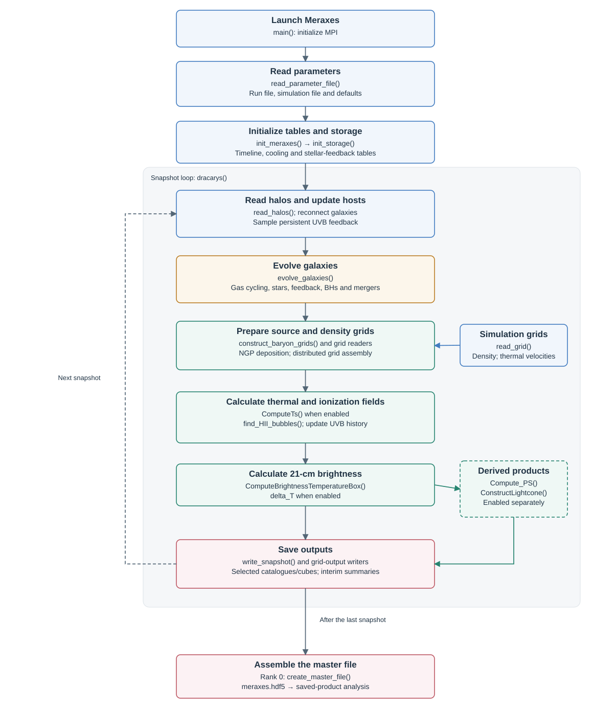
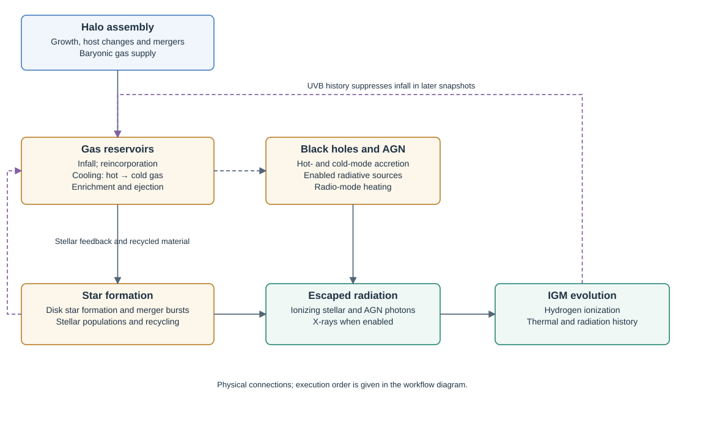

# Execution workflow

Meraxes evolves galaxies through successive halo snapshots. Their radiation
updates the surrounding IGM, whose photoheating feedback affects gas infall
at later snapshots.

Blue: inputs; gold: galaxies; green: radiation; red: outputs. Purple arrows show feedback.

## From inputs to outputs

| Stage | Main routines | Operation |
|---|---|---|
| Launch | `main()` | Initialize MPI. |
| Configure | `read_parameter_file()` | Read run, simulation and default parameters. |
| Initialize | `init_meraxes()`, `init_storage()` | Load snapshot times and physical tables; allocate galaxy and grid storage. |
| Read halos | `read_halos()` | Connect galaxies to descendants, initialize new galaxies and sample stored UVB feedback. |
| Evolve galaxies | `evolve_galaxies()` | Update gas, stars, metals, black holes and mergers. |
| Prepare grids | `construct_baryon_grids()`, `read_grid()` | Deposit galaxy sources and read simulation density. |
| Evolve the IGM | `ComputeTs()`, `find_HII_bubbles()` | Calculate enabled thermal fields, ionization and UVB history. |
| Calculate observables | `ComputeBrightnessTemperatureBox()`, `Compute_PS()`, `ConstructLightcone()` | Produce requested 21-cm brightness, power spectra and lightcones. |
| Save snapshot | `write_snapshot()` and grid writers | Save selected galaxy catalogues and grid products; advance the loop. |
| Finish | `create_master_file()` | Assemble links to rank files and grid files after the final snapshot. |

The loop includes intermediate snapshots between selected outputs. Complete
halo forests stay on one MPI rank; radiation grids are distributed in slabs.
`NSteps` must remain `1`.

## Radiation and feedback

Source deposition sums galaxy contributions in their nearest grid cells.
Ionizing sources determine the neutral fraction and UV background; X-rays and
Lyman-alpha radiation determine the thermal and spin-temperature histories.
The updated photoheating history then modifies subsequent galaxy evolution.

The source model can add escape-fraction or X-ray scatter, or replace
radiation-source SFRs with the median relation at fixed halo mass (noSFR).
Galaxy reservoirs and star-formation histories continue to evolve; modified
radiation affects later growth through photoheating. Configure these choices
in [Inputs](inputs.md#feature-combinations).

| Source treatment | Effect on emission | With source recalibration |
|---|---|---|
| Escape-fraction scatter | Lognormal draws, clipped to zero–one, change escaped formed mass and SFR. | Match their untreated totals independently, globally for each stellar population. |
| Median-SFR sources | Fit positive SFRs separately for centrals, satellites and orphans in each population; inactive galaxies remain inactive. Integrate source masses and inherit them through mergers. | Match escaped mass and SFR within each galaxy-type and halo-mass cell; match Pop. II X-ray and Ly-alpha totals globally. |
| Stellar X-ray scatter | Lognormal Pop. II luminosity draws change normalization, retaining the spectrum; Pop. III and AGN use their own prescriptions. | Match the untreated Pop. II X-ray total globally. |

Lognormal draws preserve the input median before clipping, and generally
change the mean emission. Recalibration acts during deposition, leaving
stored galaxy histories and earlier heating fields unchanged. A positive
target with zero treated escape-scatter budget stops the run; zero noSFR or
X-ray/Ly-alpha budgets remain zero.

With `Flag_IncludeSpinTemp=1`, the thermal wrapper prepares the source and
density grids before solving the IGM. Otherwise, the ionization wrapper
performs this preparation. Both power spectra and lightcones use the brightness
field, so enable `Flag_Compute21cmBrightTemp` when requesting either product.

See [Formulas](formulas/index.md) for the physical prescriptions,
and [Outputs](outputs.md) for saved datasets.
