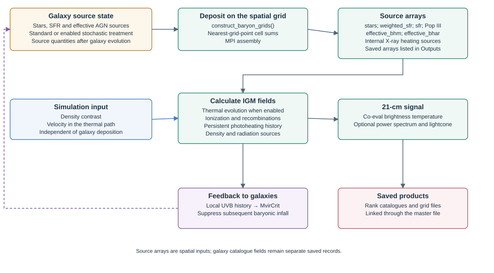

# Execution workflow

Meraxes advances the full galaxy population through the simulation's ordered
snapshots. In a coupled run, galaxies sample the previously available radiation
feedback, evolve their baryonic reservoirs, and supply the sources used to
update the IGM. Those fields then inform the next snapshot. This temporal
ordering is essential when interpreting a feedback loop.


The sequence below describes the pinned
[`dracarys()` implementation](https://github.com/qyx268/meraxes-devs/blob/90d8474cf41dcea646189fb86a65b7e18755ed95/src/core/dracarys.c).
Physical prescriptions are developed separately in
[Galaxy physics](galaxy-physics.md), [Black holes](black-holes.md) and
[IGM and 21-cm calculations](igm.md).

## 1. Launch and initialize

`main()` initializes MPI and creates a communicator. Rank 0 reads and checks
the parameter files, then broadcasts the configuration and unit scales.
`init_meraxes()` seeds the GSL random generator, defines units, reads expansion
factors from `a_list.txt`, selects output snapshots, and loads cooling and
stellar-feedback tables. Optional features initialize their photometric,
critical-mass, heating-history, lightcone, power-spectrum and recombination
state. `init_storage()` allocates halo storage and radiation grids and prepares
the HDF5 output schema.

For standard runs, `dracarys()` opens one galaxy file per MPI rank before the
snapshot loop. `FlagInteractive` or `FlagMCMC` changes storage and execution
behavior; these modes should not be treated as ordinary independent production
runs. In particular, the standalone entry point does not call `dracarys()` for
`FlagMCMC=1, FlagInteractive=0`; MCMC hooks are intended for external integration.

Source: [entry point](https://github.com/qyx268/meraxes-devs/blob/90d8474cf41dcea646189fb86a65b7e18755ed95/src/core/meraxes.c),
[initialization](https://github.com/qyx268/meraxes-devs/blob/90d8474cf41dcea646189fb86a65b7e18755ed95/src/core/init.c).

## 2. Read the next halo snapshot

The loop runs from snapshot 0 through the largest selected output snapshot,
including intermediate snapshots that are not written as galaxy catalogues.
`read_halos()` dispatches to the configured tree reader. Complete forests are
assigned to ranks so that a forest's connected evolution stays local; radiation
grids use a separate MPI slab decomposition.

Existing galaxies reconnect to descendant halos. The code handles skipped
snapshots through ghost galaxies, removes terminated branches, and creates
galaxies in eligible unoccupied central halos. It initializes merger clocks for
new infallers, copies current halo properties and updates galaxy timesteps.
Ghosts follow their dedicated passive-evolution path.

### Snapshot time and galaxy timestep

Expansion factors in `a_list.txt` define the redshifts:

```{math}
:label: run-redshift
z_i=a_i^{-1}-1.
```

The galaxy code stores the time remaining to the present, rather than cosmic
age. With the internal Hubble constant $H_{100}$ and unit system described in
[Inputs](inputs.md), initialization evaluates

```{math}
:label: run-lookback
L(z)=\frac{1}{H_{100}}
\int_{1/(1+z)}^{1}
\frac{\mathrm{d}a}{\sqrt{\Omega_{\rm m}/a+\Omega_k+\Omega_\Lambda a^2}}.
```

For a galaxy last identified at snapshot $j$, the ordinary evolution interval is

```{math}
:label: run-timestep
\Delta t_{\rm gal}=
\frac{L(z_j)-L(z_i)}{N_{\rm steps}}.
```

The current implementation requires `NSteps=1`. New galaxies at snapshot
$i>0$ use $j=i-1$; at snapshot 0 their initial interval is zero. A galaxy that
skips snapshots can have a longer interval than the adjacent-snapshot interval.
To express an internal interval in physical seconds with the supplied
$h$-scaled units, multiply by $U_t/h$.

Source: [time integration](https://github.com/qyx268/meraxes-devs/blob/90d8474cf41dcea646189fb86a65b7e18755ed95/src/core/init.c),
[galaxy creation](https://github.com/qyx268/meraxes-devs/blob/90d8474cf41dcea646189fb86a65b7e18755ed95/src/core/galaxies.c)
and [snapshot loop](https://github.com/qyx268/meraxes-devs/blob/90d8474cf41dcea646189fb86a65b7e18755ed95/src/core/dracarys.c).

## 3. Sample feedback and evolve galaxies

When patchy reionization and UVB coupling are enabled, the code computes the
critical infall mass from the stored IGM history. It maps galaxy positions to
radiation slabs and assigns the available critical masses and, when applicable,
recombination/CGM information to galaxies. Minihalo builds can additionally
sample Lyman–Werner feedback and external metal enrichment.

`evolve_galaxies()` then updates gas infall, cooling, reincorporation, star
formation, delayed or instantaneous stellar feedback, black-hole evolution and
mergers under the enabled prescriptions. Galaxy evolution also updates source
quantities; optional [stochastic prescriptions](stochasticity.md) can change the
quantities deposited in the radiation grids.

This is galaxy-reservoir evolution. The IGM kinetic temperature, spin
temperature and ionization fields are solved later, after source deposition.

## 4. Deposit sources and solve the IGM



`construct_baryon_grids()` deposits galaxy sources into the periodic radiation
grid. The wrappers read the simulation density and, in the spin-temperature
path when peculiar velocities are requested, the selected velocity component.
Each rank owns its FFTW x slabs; inter-rank mapping and reductions reconcile
galaxy positions with this grid decomposition. Real-space input fields are
saved before FFT operations when the corresponding output path calls for them.

| Coupled execution order | Condition and role |
|---|---|
| `call_ComputeTs()` | `Flag_IncludeSpinTemp=1`; prepares source/density grids, reads requested velocities, stores source inputs and computes thermal/spin-temperature fields. |
| `call_find_HII_bubbles()` | Computes ionization and associated UVB/recombination state. It prepares source/density inputs itself when the thermal wrapper has not already done so. |
| `ComputeBrightnessTemperatureBox()` | `Flag_Compute21cmBrightTemp=1`; derives the coeval 21-cm brightness field. |
| `Compute_PS()` | `Flag_ComputePS=1`; derives the coeval power-spectrum bins from the brightness field. |
| `ConstructLightcone()` | `Flag_ConstructLightcone=1`; combines successive coeval brightness fields along the lightcone. |

Power-spectrum and lightcone calculations both consume brightness information;
the power spectrum is not an input to the lightcone. Set the runtime flags
consistently: the caller does not automatically enable brightness calculation
when either derived product is requested.

With `ReionUVBFlag=0`, galaxies and patchy radiation are decoupled. The code
calls the HII solver only at selected output snapshots, followed by requested
brightness and power-spectrum calculations. This branch does not call the
thermal wrapper or the lightcone constructor. The coupled branch calls the
solvers as needed through the snapshot history, subject to
`check_if_reionization_ongoing()` and the post-reionization output policy.
See [IGM](igm.md) for the governing equations and feature requirements.

Source: [solver wrappers and gridding](https://github.com/qyx268/meraxes-devs/blob/90d8474cf41dcea646189fb86a65b7e18755ed95/src/core/reionization.c),
[snapshot control](https://github.com/qyx268/meraxes-devs/blob/90d8474cf41dcea646189fb86a65b7e18755ed95/src/core/dracarys.c).
The thermal/21-cm development is described by
[Balu et al. (2023)](https://doi.org/10.1093/mnras/stad281).

## 5. Save and advance

At selected snapshots, `write_snapshot()` writes rank-local galaxy data,
progenitor indexing, enabled distribution functions and selected grid products.
For coupled radiation snapshots without a selected galaxy catalogue, the code
can still store reionization attributes and the grid-file state required by
its history. `FlagMCMC` suppresses these ordinary writes.

The loop updates galaxy bookkeeping, releases transient galaxy-to-slab maps,
and moves to the next halo snapshot. Thermal source histories are kept in
in-memory arrays: source deposition shifts older history slots and inserts the
current fields. `set_sfr_history()` determines the retained snapshot count from
the heating calculation's causal horizon. This history is distinct from the
selected source grids saved for analysis.

After the loop, the code frees galaxies, closes every rank's galaxy file and
executes an MPI barrier. Rank 0 then creates the master HDF5 file and its links
to the rank and grid files. `cleanup()` releases remaining storage before
`MPI_Finalize()`. The master file is therefore a final assembly product, not
the file receiving all rank writes during the loop.

See [Outputs and analysis](outputs.md) for exact dataset names, units, links,
conditional products and instructions for reading the files.
